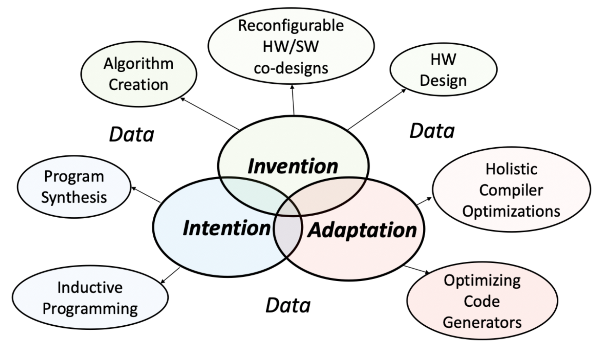

General API Background and Guidelines
#####################################

Summary
*******
The oneAPI programming model provides a comprehensive and unified portfolio of developer tools that can be used across data management engine, hardware targets, including a range of performance libraries spanning several workload domains. The libraries include functions custom-coded for each target architecture, so the same function call delivers optimized performance across supported architectures. Python, C, and C++ are the languages to based encourage ecosystem collaboration and innovation. To ensure comparability, we will want to have Cython and C/C++ APIs to connect to DPC++. The Intel wide APIs are defined in One API with the programming manual.

Within our development, we are embracing the Intel One direction and vision by collaborating on enabling Machine Programming. Machine programming is a fusion of different fields. It uses automatic programming technique, from precise (e.g., formal program synthesis) to probabilistic (e.g., differentiable programming) methods. It also uses and learns from everything we've built in hardware and software to date. Powered with OneAPI, we have a formula to cohesively have: onsite response, quality products, a service to improve up-time, and much more. Our usage has shown a 7x SLA speedup via automation of telemetry; thus, we are continuing the effort to scale organizations.

Machine Programming
===================

.. raw:: html

    <iframe width="560" height="315" src="https://www.youtube-nocookie.com/embed/JMBEmUMSo8M" title="YouTube video player" frameborder="0" allow="accelerometer; autoplay; clipboard-write; encrypted-media; gyroscope; picture-in-picture" allowfullscreen></iframe>

Pillars
--------
- Intention: Discover the intent of a programmer.
- Invention: Create new algorithms and data structures.
- Adaption: Evolve in a changing hardware/software world.

    Three Pillars of Machine Programming.

High-level compelling endpoint general areas:
    - Productivity: Improve programmer productivity by at least two orders of magnitude.
        - Requiring < 1% of today's effort.
    - Synthesis: Superhuman software creation in terms of:
        - Performance, Correctness, Security, Accuracy
    - Reconfiguration: Optimize operation through learning techniques by blurring lines of:
        - hardware, firmware, driver, and software.

    Scope of Machine Programming (MP).

Machine Programming Domains
    - Compilers essentially transform higher-level algorithms and data structures to include lower-level details.
    - Compute is hardware, algorithms, libraries, and ecosystem.
    - Intelligence is focused on deep learning and machine learning.
    - Synthesis is a program using probabilistic or direct transformation techniques.

Data Decomposition
    1. Anomaly, healthy, etc. snapshot(s)
    #. Binary
    #. Map Identifier(s)
    #. Data Object Container(s)
    #. C, C++, or Python API
        - Directed Acyclic Graph
        - Time Series
        - Profile
    #. Application Engine(s)

    .. figure:: images/MP_OAPI.png

        Application Instance(s) Topological hierarchy for the usage of data processing. Example instance for Business Unit (BU).

High Level Stages in the Application Instance(s)

    - Object Mapper: API to map system, devices, products, etc. with the known features.
    - Data Object Container(s): Translated objects within an encapsulated form.
    - Translator: API to traverse the vector to the appropriate machine translator.
    - Profile, Graph, Time Series Extractor: The APIs to machine programming generated signature paths, dependencies, relational information, etc.
    - Data Management Linker: The data management engine to link all the Meta into the optimized topological instance for usage.
    - Analysis Engine: Generic applications used to compute, infer, evaluate, etc. useful in rapid analysis. These can be stand alone or chained operations to lead to conclusive findings.

Dependency on Object Mapper to Data Object Container(s)
    - eUID_#_t: Enumerated unique identification number of a given data object.
    - Major: Version information representing a unique restructuring.
    - Minor: Version information representing a unique restructuring.
    - Data: The data payload with defined content.

    .. figure:: images/MP_ContainerMap.png

        Data identification tree path for an individual structure.

Profile, Graph, Time Series Extractor
    .. figure:: images/MP_TS.png

        Example time series creation from data object container(s).

Data Management Linker
    .. figure:: images/MP_DML.png

        Example mapping of multiple time series in relational context.

Analysis Engine(s)
    .. figure:: images/MP_AE.png

        Neural network considering the features of a given data management link.

Data Save Requirement(s)
=========================
To adequately ensure we are encapsulating Meta data with reasonable context; we need to ensure the following Manifest List status is included below

Source System Context
---------------------
- User Identification: External Customer (Dell, IBM); Internal (ConVal, RDT, EBT, Developer Bench); Parallel BU (DCG, CCG, PEG, Labs, etc.).
- Preconditioning: Sequential pack write of virtual Range.
- Previous Status: Device State space before execution context.
- Execution: Workload, Focused Feature Test, Platform Test, etc.
- Human Interaction: Connecting Probe, Pulling Parallel Devices (Hot-Plug), Firmware upgrade, etc.
- Machine Interaction: AI controlled Bot to simulate device hot plug every 10 seconds, control arm exposure to Alpha and Beta Particle generating radioactive material to simulate space, etc.

OS System Information
---------------------
- EPOCH system time.
- Operating System with Update(s).
- Device Identification List, Status, up-time, Anomaly Time.
- References for System Information
    - https://www.tecmint.com/commands-to-collect-system-and-hardware-information-in-linux/
    - https://docs.microsoft.com/en-us/powershell/scripting/samples/collecting-information-about-computers?view=powershell-7

Solid State Drive (SSD)
-----------------------
- Data Payload(s): Binary format, time series linkage, Preconditioning.
    - Controller Initiated Telemetry Asynchronous Command (CiTAC).
    - Host Initiated Telemetry Asynchronous Command (HiTAC).

Compress API(s)
---------------
    - Input
    - Output
    - Meta Context
    - (Optional) Batch Requests

Relational Analysis Library API(s)
----------------------------------
- Processing Module(s)
- Necessary Object Input(s)
- Intermediate Representation Object(s)
- Target Object Output(s)
- Dependency Graph
    - Input-Module(s)
    - Flow Map
    - List Generation
    - Projected
        - Resource(s)
        - Execution Time per Path
        - Power (Energy Consumed)

Developed Learning Path(s)
--------------------------
The constructed paths will be a certification to be an expert in the domain with necessary requirements.

References
^^^^^^^^^^
1. NSG Data Lake specific AGS accesses (Inside Blue page). https://soco.intel.com/docs/DOC-2605534
#. IT's Big Data Ecosystem with Tools, BKMs, Environments. https://wiki.ith.intel.com/display/BIBigData/Hadoop+Ecosystem+Tools
#. Access Wiki for Intel Software Tools. https://wiki.ith.intel.com/display/ssgistm/Parallel%20Studio%20tool%20page#ParallelStudiotoolpage-GettingParallelStudio and http://goto/ssg-ilc
#. Justin Gottschlich, Armando Solar-Lezama, Nesime Tatbul, Michael Carbin, Martin Rinard, Regina Barzilay, Saman Amarasinghe, Joshua B. Tenenbaum, and Tim Mattson. 2018. The three pillars of machine programming. In Proceedings of the 2nd ACM SIGPLAN International Workshop on Machine Learning and Programming Languages (MAPL 2018). Association for Computing Machinery, New York, NY, USA, 69–80. DOI:https://doi.org/10.1145/3211346.3211355
#. "Why More Software Development Needs to Go to the Machines". https://newsroom.intel.com/news/why-more-software-development-needs-go-machines
#. Machine Programming Direction Lecture (Justin). https://www.youtube.com/watch?v=JMBEmUMSo8M&feature=youtu.be
#. Training Material https://analyticsmarketplace.intel.com/

Storage Container Web Interface and API Requirements to Data Lake Store
-----------------------------------------------------------------------
Creation of Web Server(s):
    1. Reserve sub-domain
    #. Create Apache Server instance linked with sub domain
    #. Create a Web Application Firewall (WAF)
    #. Create a TLS for Web interaction (Open SSL)
    #. Add required analytics tracker for client webpage
    #. Tracks information such as: MAC address, IP, Username, Geographic, Machine token identifier
    #. Use interface such as:
        - Hardened PHP
        - http strict transport security (hsts)
    #. Create isolated verification virtual machine instances
        - Instances check each of the items above. The server will not perform these tasks individually as it will be the first line of content verification.
        - Use a random of 3 multi casters virtual machines to simultaneously process the transaction in the case of a single attack vector.
    #. Disable
        - Any additional ports
        - Remote access to File upload server
        - Write OS privileges for all users except service and stage data into containers.
    #. APIs
        - Python 3.x
        - HTTP(s)/2 TLS
        - Unique VPN DMZ for Telemetry

Security Requirement(s)
-----------------------
- Attack Protection Vectors
    - Entry point cannot execute binaries.
    - Each file should be scanned for malicious content.
    - File meta cannot be in plain text to ensure no file paths can be exploited.
    - Payload Size Limitation(s)
        - 1500 bytes of payload, the limit set by the IEEE 802.3 standard.
        - 9000 bytes of payload, the limit set by jumbo frames.
    - File Content Transaction(s)
        - Each set of content should have a SHA- 512 signature.
        - Data Encryption Public RSA Key 4096 bit.
        - Each data area section for construction of the payload we should have a SHA for a collection of blocks with a secondary private key only known to the tool.
    - Distributed denial of service (DDOS)
        - Connection instances are limited to the current usage of the server
            - For example if the server has 256 connections and only two users then the split would be 128. When more users  connect these should be reduced to a minima of one connection with round Robbin Quality of  Service (QoS).
- Cipher Point(s)
    - Key Exchange
    - Digital Signature
    - Message Authentication
    - Hashing Algorithm
- Connection to Server minimum TLS 1.3
    - TCP Port 443 is the standard port for HTTPS
- Key Set(s)
    - Public Certificate, SSID Certificate, Private 'Application Known' Certificate for User Signature

Application Programming Interface (API) for Standard Polymorphic Set-Container(s)
---------------------------------------------------------------------------------
- Construction: Creation.
- Deconstruction: Deletion.
- Exception: Thrown exception for a catch handler.
    - Throw: Exception assertion and triggers for handling for graceful exit.
    - Catch: Exception de-assertion and trigger handler for object.
- Compress: Optimized the data structure or archival and space usage
- Decompress: Performs optimization for fastest run-time operation.
- Access: Methods used to gather features of the container.
    - Context: Data fields and relational information of the container.
        - Type: Inherent data type of underlying structure
        - Get: Gets a field or container set
        - Count (all, range): Counts the total features in a set or container.
        - Size: Total bytes occupied by container or subset.
        - Capacity: Total bytes possible for container before re-sizing.
    - Iterator: Creation of a pointer to the container for traversal.
    - Empty: Status of the object context stating if there is no occupation of Meta.
    - Front: Iterator to the start of the container.
    - End-Back: Iterator to the end of the container.
    - Search (container, feature, relation): Operation of traversing object for given constraints.
    - Print: Streamer for console, text, python, CVS, JSON, etc. file output.
    - Permutations: Returns the possible total variants of the data container.
    - Combinations: Return the combinations of the variant container.
    - Copy: Returns a duplicate of the container.
    - Reference: Returns a unique reference hash to the container.
    - Generate Sequence: Generation functions of the container.
        - Sequence:  Generates the sequence of operations on the object.
        - UML: Generates the graphical mapping of Sequence.
        - State Machine: Generates the traversal ordering of the sequence, actions, and transitions.
        - Adjacency list: List representation for a graph associates each vertex in the graph with the collection of its neighboring vertices or edges.
    - Translate (human, machine, type overlay): Unpacks a data container with the corresponding decoders; specifically, for machine formatted data.
- Mutate: Methods used to change the features.
    - Set: Changes a field or group according to usage.
    - Clear: Setting of all fields to a default or defined profile.
    - Erase (iterator,range): Erase the instance or range of instances.
    - Remove: Removal of the container from the data set and container returned.
    - Pop: Removes the data container set within the object.
        - Front: Removes the first data container set within the object.
        - Back: Removes the last data container set within the object.
    - Push: Insertion a data into an object.
        - Front: Inserts the first data container set within the object.
        - Back: Inserts the last data container set within the object.
    - Insert (iterator, set): Insert of the data at a specific location within the object
    - Resize: Addition of space into the object in terms of bytes.
    - Operators: Basic mathematical, logic, Boolean, operators on data such as addition of integers or concatenation of strings.
    - Sort (compare): Sorts the container through compare rules.
    - Reverse (Compare): Sorts the container in reverse order.
    - Random Shuffle: Reorders the query into a random order.
    - Override: Mutates the structure into a destination container type or container reference.
- Map: Functions to perform high level tasks on container.
    - Unique: Removes duplicate copies of objects and links to single root reference.
    - Lower Bound: Returns the iterator for a given key.
    - Upper Bound: Returns the iterator before the given key.
    - Iterator Switch: Switches the iteration format based on traversing methodology.
    - Alias: Add reference to tag the entry with an additional tag.
    - Intersect: Determine the intersection or common container components
    - Union: Create the list of all features between containers.
    - Snapshot: Creates an instance of the container in the current form.
    - Profile: Creates a set of features identifiable for the type to use to overlay onto other data.
    - Similarity Measures: Algorithms to determine the feature similarity.
        - Distance (Iterator(s)): Returns the unit distance between keys in vectored form.
        - Shortest Distance (Iterator(s)): Returns the optimized ordering of iterators to traverse.
        - Static Distance Measure: Measuring methods requiring exact context or a direct translator.
            - Euclidean Distance Measure: Direct 1 to 1 comparison.
        - Elastic Distance Measures: Methods with flexibility in measures such as Sequence Weighted Alignment Model being an unconstrained and constrained with Sakeo-Chiba or Itakura parallelogram.
            - Longest Common Sub-Sequence: Determines the least common subsequent between containers.
            - Dynamic Time Warping: Distance measures with repetitive patterns.
            - Edit Distance with Real Penalty: Distance measure with local time shifting.
            - Edit Distance on Real Sequence: Gap distance measure between objects with local time shifting.
- Stats: Enables tracking of the operations of the container.
    - Start: Enables of feature.
    - Stop: Disables feature.
    - Difference: Return the change difference between two references.
    - Timer: Timer functionality feature enable.
    - Track: Calls and sequence traversing of the operations.
    - Basic: Triggers the enable of min, max, average, median, variation, deviation, etc.
    - Full: Triggers all of the features to be used.
    - Log: Log all of the operations conducted.
    - Regress: Constructs the minimum steps to reproduce a set of operations.

Library Infrastructure Interface Documentation
----------------------------------------------
    - MongoDB docs: https://docs.mongodb.com/manual/
    - Mongodb docker https://hub.docker.com/_/mongo
    - Dockerised mongodb instance for reporting tool
        - Pymongo docs https://api.mongodb.com/python/3.6.0/tutorial.html
    - oneDNN performance reporting tool https://gitlab.devtools.intel.com/ipl_infra/perf-reporter
    - Flask docs https://flask.palletsprojects.com/en/1.1.x/
    - Atlassian https://blog.developer.atlassian.com/artificial-intelligence-for-issue-analytics-a-machine-learning-powered-jira-cloud-app/
