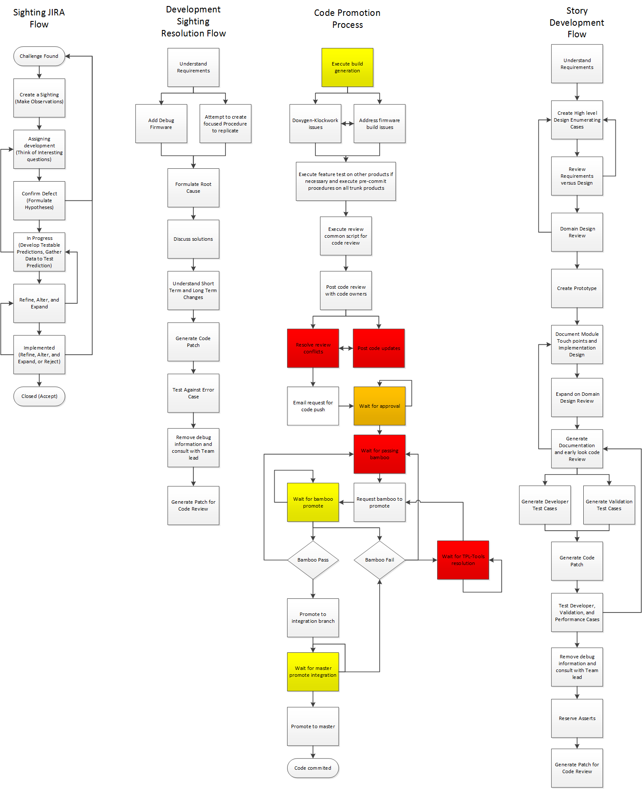

Accelerating Code Velocity to Integration
=========================================

    Development, code, and promotion flow.

Actions Required
----------------
    - Time per module
    - Links to wiki documents.
    - Invention Disclosure Form for automated mechanism
    - Meta parsing scripts

Trunk Code Promotion Definitions
~~~~~~~~~~~~~~~~~~~~~~~~~~~~~~~~
#. Execute build generation:
    - The code build generation for trunk will build all targets for active products in development. These typically include development firmware, customer firmware, injection testing, and platform specific builds for each product line. The time to execute the build is done with the following command python buildgen3.py -makeasserttables -keepgoing is approximately 45 minutes to 60 minutes.
#. Doxygen-Klockwork issues:
    - In generating the code, we run two scripts to do documentation analysis for code and static analysis to address conditions possibly resulting in a customer failure. These changes are necessary to maintain code maintainability and to address challenges in smaller granularity compared to large efforts.
#. Address firmware build issues:
    - To ensure code is maintainable, we run the full builds across all products to rest product based build switches or product specific features. Due to disjoint features among the products, our compiler will either add functionality in the libraries as necessary. Resolving build challenges typically attempting to catch the library paths not exercised in the story for the current development.
#. Execute feature test on other products, if necessary, and execute pre-commit procedures on all trunk products:
    - Depending on the product family, a feature may exist in other products and if there are disjoint versions the feature test needs to be executed to ensure compatibility among deployments. Pre-commit procedures are necessary to catch gross failures that stop product development in our common code model.
#. Execute review common script for code review:
    - The expectation is for engineers not knowing the domain ownership, the names generated will point them to the correct stake holders. These are expected to be concrete ownership.
#. Post code review with code owners:
    - The code is typically posted to our fisheye-crucible online tool at which stake holders can mark items as conflicts and make suggestions to change. The challenge here is there is no clear decision maker for a product or common code model.
#. Resolve review conflicts:
    - Review conflict can be marked as code style, standard, etc. marked with criticality accordingly. The update for these changes should focus the engineer's scope. For example, the architecture should check if it maintains the encompassing customer needs and domain owners can note for complications or extensibility.
        - The changes here can range from code style to encompassing requests. The limits of the code review scope are often diverged into tasks that are related to technical debt. For changes outside of the scope of the active development, it is proposed the stakeholder defines the development such that the story will follow the development flow for review. The timeline for the code review is uncertain most of the time as responsiveness is lacking from owners and can be difficult to contact. A rule for resolution needs to be in place such as a bot to remind engineers and when no action is needed managers are automatically notified to do follow up with the engineer owner. In the event time expires past the deadline, the code should be allowed since the developer is blocking progress.
#. Post code updates:
    - The updates are to address conflicts and overlying functionality concerns.
        - The challenge for this is as the code progress from version to version is without explicit expectations and goals set the update procedure can diverge into an infinite update loop.
#. Email request for code push:
    - The request for a code push is to communicate the JIRA, code review, summary of the challenge, complexity, scope, and testing procedures.
        - The challenge is information is often communicated in the JIRA or code review and the procedure assumes the developer was not diligent.
        - The email format varies significantly across programs and long branches, and requires non-negligible manual effort to populate needed tables and provide relevant information. An outcome of this is that developers populate the bare minimum in the required fields, which can result in an approval email that contains little to no information of use to a TPL approving the request, which either results in pushback or a rubber stamp, neither of which improve velocity.
#. Wait for Approval:
    - Approval is mechanism to ensure pushes are such that changes do no collide together.
    - The challenge here is the approval should have been known through the trunk synchronization mechanism and the additional time to review slows the code promotion process a day to two.
#. Request bamboo to promote:
    - The process to request is for when the code has been integrated to the closest integration working node. The code is executed on our tools to see if there are common path functionality issues.
#. Wait for bamboo promote
    - Waiting for bamboo to promote is a mostly polling process.
        - The challenge here is the promote process should be interrupt driven so the developer is notified of the status and can work without having to check the status manually.
#. Wait for TPL-Tools resolution:
    - These are challenges the encompassing tools have difficulty in coverage. These can include code changes, tools update, server up/down time, and infrastructure.
        - The challenges here are there are several avenues of failure and each subsystem should appropriate secondary systems to restore the functioning state.
#. Promote to Integration Branch:
    - When bamboo has pass the code is then promoted to integration branch such that code is now a candidate to master.
#. Wait for Master Promote Integration
    - The code goes through a secondary flow that check the integration merge with the master node as a secondary mechanism to attempt to catch intermittent challenges.
        - The challenge for the promotion of integration to master is the actual landing of code in the main repo for continuous validation is unknown and the status is not apparent in our JIRA tools. Tracking these changes is a manual process and requires searching for the individual change set.
#. Promote to Master
    - The promotion to master is after the completion and the code is now in transition to the master code branch.
#. Code Committed
    - The code at this stage is known to be in the master branch and ready for continuous validation.
        - A mechanism linked to JIRA or a notification to the stakeholders would be useful for blocking items.

JIRA Sighting Flow
~~~~~~~~~~~~~~~~~~~~~~~~~~~
#. Create a Sighting (Make Observations)
    - Define the problem by creating a sighting based on Triage information which is a formulation of a question based on observation from triage members. The triage process will collect evidence, experiments, and correlation between known issues.
    - Common information will include detailed information on system configuration (driver, firmware, tools version), time to failure, default failure analysis data, steps to reproduction, and last known good configuration.
    - A sighting created moves from new to assigned development at this point.
    - Jira Procedure
        - Mark Issue Type as Sighting.
        - Update JIRA Main: Summary, Priority, Exposure, Program, Affected Products, Suspected Problem Area, Affected Products, Submitter Org, Assign Team.
        - Update JIRA Details: Development Platform.
#. Assigning development (Think of Interesting questions)
    - Depending on the workload of the team the program manager, system technical product lead, and technical leads will review the debug data.
        - Upon first pass of the data, each member will quickly review the debug data and determine the focus team appropriate for further investigation.
        - When strong correlation is determined between known issue and the concerning area at hand the development by determining a highly similar failing case signature, then the development will be marked as duplicate and linked as 'is duplicated by' following the closure of the parent node the sighting will be re-evaluated such that the failing case is satisfied otherwise the issue will be moved to confirm defect and the link will be moved to 'is related to'.
#. Confirm Defect (Formulate Hypotheses)
    - Technical team lead and team member will move sighting to confirm defect based on the experiment, analysis of data, and reproduction.
    - The team members will specify the requirements and identify variables violated in the defective case.
    - If there are multiple failure conditions then additional JIRAs will be generated for each challenge and mark as related to.
    - Update JIRA Main: Source of Error.
#. In Progress (Develop Testable Predictions, Gather Data to Test Prediction)
    - Based on evidence, the team member will investigate the fault area beginning to formulate a predictive mechanism or existence of defect in design.
        - The process will involve understanding underlying mechanisms and system interactions to classify the failing case. The development of the failing case will involve understanding the control flow and data flow graph with the behavioral expectation to the error classification.
        - The general failure condition will show a trace of valid conditions until one is not met in the flow such that the coverage of all cases are depicted in a manner such as Boolean algebra, truth tables, sequence diagrams, finite state machine (deterministic finite automata), etc.
        - The developer will develop and clarify the focused experiment, cases, and predictions for the root cause. The developer will gather data to conclusively replicate the failure or conditions that lead to such a situation.
        - The developer will cultivate and expand a hypothesis on the finding to give exact clarity and repeat the development until the conclusive root cause is understood. When the developer exhausts resources or strategies the failure will be promoted to a brain storming session or working group to further understand failure to develop a collective hypothesis or explore mechanisms until a relevant formulation is reached.
    - Refine, Alter, and Expand
        - Upon proving the root cause of the failure, the developer will understand and propose solutions based on the architecture and implementation to address the concern and maintain future extensibility.
        - For special cases, a workaround or short term fix until a long term solution is provided.
        - Build a prototype to test defective case proving solution definitively resolved the original defect.
        - Before completing the solution, the developer must ensure the requirements are met and communicate results to technical lead, system technical product lead.
        - The solution will follow the standards defined for the product library and appropriate reviews before promoting to live library testing.
#. Implemented (Refine, Alter, and Expand, or Reject)
    - After the developer has completed failure case resolution the system technical product lead will communicate the attention of the resolution case where the solution will be tested in an independent controlled environment the failure was produced in confirming the solution is appropriate in the common product library.
    - If a specific hardware workaround is necessary, a development story will be created and reviewed in the cross functional domain forum. In the case, the change is between hardware revisions and a hardware change is expected to commit a change.  Then an additional story is to be created for the development platform to be tested against and the final platform. All of these stories will be linked as found by the original sighting.
#. Closed (Accept)
    - Duplicate or linked issues are to be reviewed and verified against the solutions and if the change address the failure the duplicate will be closed as a duplicate, otherwise, the JIRA will be unmapped and reopened to assigned development.
    - Solution is determined to be adequate for test case and corresponding horizontal technical leads should be made aware of the item resolution.
    - Follows to the solution that alter the architecture or expose failure conditions must be communicated to forward looking teams in a functional change in the ASIC, Firmware, Media, and/or Tools.
    - Update JIRA:
        - Fixed in Component, What Changed, Resolution Description, Affected Platforms, Milestone.
