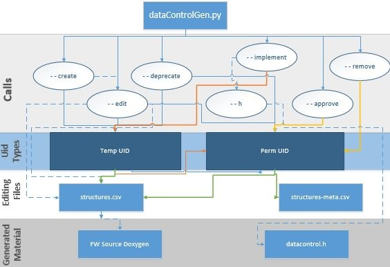
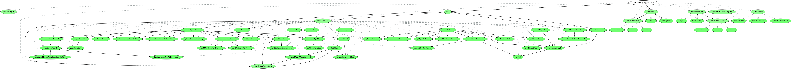

Data Control Assistance for Machine Programming
===============================================
Our scripts manage reserving and updating datacontrol.h file upon creation of new data structures.

.. figure:: images/datacontrolFlow.jpg

    Datacontrol Flow

Related File Overview
---------------------
The key feature of our automated management engines are each data structure is assigned a unique identifier (UID) to be tracked for the source code repository. The UIDs are key for identifying a data structure dependencies, classifications, etc. "findTags.py" is a script to detect data structures for source control management; which generates "baseTags.py" used as a baseline to detected aggregate data in source code. "cTypeAutoGen.py" and "autoParser.py" are variants of tools which uses input the project name and unique identifiers (UID[s]) of the data structures we would like to create parsers for it. The modes of operation are audit and generate, which will use defined objects and will attempt to audit/create parsers for all data structures it finds in the respective data control file (datacontrol.h).

"structures.csv" is the source which is used to generate "datacontrol.h" automatically and provide a reference for developers, system integrators, and validators. "datacontrol.h" is a C/C++ language target file used for the tracking and matching of UIDs to their structure names in the code repository. Depending on the repository and project for which it is compile/synthesized, "datacontrol.h" can contain different variants of structures supported in that code build. A feature of our management engine is "datacontrol.h" is a generated set of code semantics for developers to use. The purpose of code generation is to minimize human errors and ease requirement generation of a given data structure. It is recommended to use the provided interface since our system provides validation  semantics on scripts and data formats such that in a rapid code release we can automatically update all stakeholders of the source code.

STEP 0: Guided Telemetry Input
^^^^^^^^^^^^^^^^^^^^^^^^^^^^^^
Allows a guided walk-though of how to CREATE and EDIT data structures. This is important because it allows the detection of embeddings code documentation and standards directly into a UID creation/edit.

To get guided step-by-step of uid creation  call:

.. code-block::

    $ python datacontrolgen.py --guide create
    0 error(s) found

To get guided step-by-step of uid editing call:

.. code-block::

    $ python datacontrolgen.py --guide edit
    0 error(s) found

STEP 1: Creating a Telemetry UID
^^^^^^^^^^^^^^^^^^^^^^^^^^^^^^^^
Creation of a UID is started when the developer implements the structure in the native language source and uses Doxygen/Language style comments necessary in tagging a data structure. Each UID is processed by automatically specifying a temporary UID and assigning properties of the structure as done in the editing phase. Creating a temporary UID locally generated to the latest specification for the repository state generating the version control based on historical semantics making the process of updates an ease for developers.

To create a temporary UID, run:

.. code-block::

    $ python datacontrolgen.py --create [<temp-uid>,<structName>,<dataArea>,<dataGroup>,<product>,(<editAssignments>)]
    0 error(s) found

For Example:

.. code-block::

    $ python datacontrolgen.py --create [AUTO,testStructName1,6,Transport_PART,ADP,(description='This_is_a_description',owner='SomeUser',major='3',minor='10')]
    0 error(s) found
    Values in (<editAssignments>) need to be in format: variable='Non-space-alphanumeric-value'  and multiple variables should be separated by a comma, making sure no spaces are introduced.

Multiple actions at Once
    - Running multiple actions on the same command is supported, Each instance is separated by a semicolon ( ; ) for scripting bulk modifications.

STEP 2: Editing a Telemetry UID
^^^^^^^^^^^^^^^^^^^^^^^^^^^^^^^
For a guide on which values can be specified, see "structures.csv" for examples, or Telemetry MetaData Guide below.

To edit a UID, specify the telemetry version as it appears on structures.csv that you would like to edit, then specify the option to edit:
    - Edit can be called on both temp-UIDs and permanent UIDs. To edit run:

.. code-block::

    $ python datacontrolgen.py --edit [<temp-uid>,<telemetry_version>,(<editAssignments>)]
    0 error(s) found

The following command will result in Test_struct, with uid 33 for telemetry version 2.0, to be changed to Test_struct version 1.0 by Juan and respective others.

.. code-block::

    $ python datacontrolgen.py --edit [33,2.0,(version=1.0,owner=Juan Diaz)]
    0 error(s) found
    $ python datacontrolgen.py --edit [35,2.0,(version=1.0,owner=Joe Tarango)]
    0 error(s) found
    $ python datacontrolgen.py --edit [34,2.0,(version=1.0,owner=Andrea Chamorro)]
    0 error(s) found

Edits DO overwrite previous information, and for this reason for these changes to be permanent (exists outside of just your current working repository), they must be pushed by calling --implement

Edits will fail if you try to edit a temp_uid that does not exist and if you meant to create a UID from scratch with the edit properties, use the --create functionality.

STEP 3: Implementing a Telemetry UID(s)
^^^^^^^^^^^^^^^^^^^^^^^^^^^^^^^^^^^^^^^^

Once you have a temporary UID, you can now call "–implement" to reserve a permanent UID for your structure. Until this is done, you will not have a permanent UID in the Application Programming Interface (API) used in the telemetry code, meaning your temporary UID will be generated with a different UID number each time "datacontrol.h" is generated. This process created to enable testing and developing of temporary UIDs without reserving a permanent UID. The temporary  UID will be generate and presented as permanent UID in the APIs used in the telemetry code, but keep in mind the UID number of those temporary UIDs can change each time "datacontrol.h" is generated. This process of implementing a UID ensures that no UID is assigned twice, maintaining uniqueness.

Temporary UIDs in structures.csv are in the format: temp_<identifier>

Temporary UIDs in datacontrol.h are in the same format as permanent UIDs.

To implement a uid: Create a temp_uid to track the Structure.
Call:

.. code-block::

    $ python datacontrolgen.py --implement
    Your struct temp-2 is assigned uid: 345
    0 error(s) found

The call to implement will make changes in "structures.csv". These changes will govern a difference in "datacontrol.h", so regenerate "datacontrol.h" with:

.. code-block::

    $ python datacontrolgen.py --header
    0 error(s) found

    - Note: this generates a datacontrol.h header in the current directory. The build will automatically generate "datacontrol.h" as part of the build output artifacts on a per-build basis.

Commit your local changes to "structures.csv" and "datacontrol.h" onto your topic branch. It is important that "structures.csv" is updated properly; otherwise, you will have lost your newly made UID.

Implementations still need to be approved by a repo-meta superuser to be binding, but in the meantime ensure no one uses the UID you implemented by requesting it in our streamlined development tracking system.

STEP 4: Tagging a Struct in Source
^^^^^^^^^^^^^^^^^^^^^^^^^^^^^^^^^^
Tagging occurs in source and is the foundation for automatic updating of "structures.csv".

To tag, Add the UID's data structure to the source:

.. code-block:: cpp

    struct newStruct_s {
    ///< UID: <description> and standard template information.
    // singletons, data members, inherited objects, etc.
    } newStruct_t;

Save the Source file.

STEP 5: Code Review
^^^^^^^^^^^^^^^^^^^
An repo-meta superuser needs to be added to the code review for your UID reservation change in order to approve the UID reservation on repo-meta. Adding data structures should have a valid reason and criteria for such that each is systematically architected, maintained, useful for debugging/logging. Please be aware the velocity of updates, and logging can impact performance so use our automated performance analysis tools to ensure changes do not impact critical paths unnecessarily.

STEP 6:  Repo Pull
^^^^^^^^^^^^^^^^^^^
Request your branch code to be pulled to Trunk. Once pulled, data control reservation process is complete. Please remember we are a team of developers and using the process will ease communication and automate the boring stuff.

NOTES
^^^^^
Mitigating Incorrect Use of DatacontrolGen
""""""""""""""""""""""""""""""""""""""""""
    - Periodic checking of repo-meta by superusers is the best way to ensure no damaging changes are made.
    - The local "structures.csv" is the ultimate source of information for data control information specification in a repository, and incorrect changes will manifest themselves in the form or errors in running build scripts with flags such as --ctypeautogen.
    - Automatic up keeping of "structures.csv" based on source code is a continuing process so improve source code when time permits in the development phases since small updates will limit large refactors.
    - "structures.csv" should always be cross checked with repo-meta as part of the code review process.

Review Process
""""""""""""""
    - UIDs are restricted to strings between 1 and 8 characters, and can only include ``\[a-zA-Z0-9_ ]`` characters and within the native language specification nomenclature.
    - Due to language restrictions, no spaces are allowed when specifying list of UIDs in command line. THIS IS A PROBLEM FOR COMMENTS AND NAMING.
    - "datacontrolGenMeta.py" is all or nothing, by design and will try to implement what it can.
    - arguments to edit assignments that are meant to be read as strings and should be single quotes (') since we use python as our preferred portable parsing language.
    - Editing a specific version and UID is not supported since we have semantics in our model to ensure coherence and everything else can be edited (UID, MAJOR, AND MINOR LIKELY SHOULD NOT)
    - If structure is novel a temporary UID allows for changes in the early development phase.
    - If in debug mode, local repo-meta will not get committed or pushed
    - For complicated inheritance, forward declarations, etc.; imports in "datacontrolGenMain.py" may fail due native language corner cases.
    - Be careful that each --flag has a space before and after it as this is how we tokenize and identify disjoint elements.
    - All Edits are only local and final edits occur automatically at the time of pushing to the tip branch and may require coordinated merging. Methods for automating these steps can be performed by our final push scripts since all final pushes are atomic in nature.
    -  Lastly, refrain from manual edits to "datacontrol.h" except for using "datacontrolgen.py" and if you see the need for improvements please do so with a stakeholder review. Remember we are a community a if you see room for improvement it can significantly improve organization velocity.

    Flow for development.

Repo-META SUPERUSER COMMANDS
""""""""""""""""""""""""""""
Approving Implementations
    - You've called implement before the CSV file was ready to implement! Here are security measures to ensure things do not get messed up.
    - Namely, the implementation still needs to be approved by someone who has access to repo-meta trunk. Approving can be done by a superuser using the "datacontrolGenMeta.py" script.
    - To implement, checkout a local copy of repo-meta, and run:

.. code-block:: cpp

    $ python datacontrolGenMeta.py --approve <uid>
    0 error(s) found

Push your changes to branch and if you don't have permission, an error will result.

Incorrect calls to --implement

    - If an effort to create a new structure has been abandoned, get in contact with a superuser access to repo-meta, listed in contacts list in repo-meta, and make them aware an effort tied to the UID implementation has been abandoned. They will go in and --delete the UID, (only allowed if the UID has not yet been approved yet) to allow its future use. Otherwise, this UID has been reserved permanently.

Deleting Implementations
    - If an effort to create a UID has been abandoned, all relevant UID information is removed from "structures.csv", and the UID has not been approved, a UID that was implemented can be reclaimed.
    - Removing a UID that has been approved is not allowed and will result in an error.

A repo-meta superuser can remove the uid reservation in repo-meta by calling:

.. code-block:: cpp

    $ python datacontrolGenMeta.py --remove <uid>
    0 error(s) found

Developers: Pushing Changes to Code Repo
"""""""""""""""""""""""""""""""""""""""""""""""
    - If developing in repo-meta, it is imperative to test your branch before pushing.
    - To test use "datacontrolgenwrapper.py" in the repo
        - Edit it > Insert the following below repo.clone():
        - repo.gotoBranch("insertyourbranchnamehere")

This will prevent you from making pushes to origin in repo-meta when testing.

Code Review Process
"""""""""""""""""""
"datacontrolGen.py" keeps a mixture of code-defined and non-code-defined characteristics, therefore, the review process for changes should be separated from the code review process for the code itself, so that these reviews can be directed and specific for the relevant reviewers. It is a good practice to limit code reviews with data-control related changes to firmware and metadata to their own branch, own code review for fast approval, and exception cases can be made for ninja developers (however, this is rare).

For this reason, to --implement changes to data control, a code review in repo-meta is created in its own branch to match your local changes, and code review of your local repo latest changes are made in parallel to a code review to your repo-meta changes. Only request pull to branch once both have been approved.

Data Control Struct Meta Information Grid Table

+------------------+-------------------+---------------------------------------+-------+-------+-------------+------------+-------------------------+---------------------+-----------+----------------------+-------------------+------------+------------+------------------------------------+--------------+------------+
| uniqueIdentifier | Telemetry Version |  Autoparsable (Product, [Sub-Builds]) | major | minor | persistence | dependency | Security Classification | byte size (Decimal) | Data Area | Structure Duplication | Data Object Group | GlobalName | Size (Hex) | Within Assert	Product [Sub-Builds] | Domain Owner | Definition |
+==================+===================+=======================================+=======+=======+=============+============+=========================+=====================+===========+=======================+===================+============+============+====================================+==============+============+
+------------------+-------------------+---------------------------------------+-------+-------+-------------+------------+-------------------------+---------------------+-----------+-----------------------+-------------------+------------+------------+------------------------------------+--------------+------------+

Definitions
    - uniqueIdentifier
        - Documented unique value obtained by the --reserve process
    - Telemetry Version
        - Prefilled to latest telemetry version and can be edited manually if need be. The interface of telemetry is version controlled by specifications.
    - Autoparsable (Product, [Sub-Builds])
        - Documented by CtypeAutogen success, which updates the local csv. for a product and/or sub-bilds
    - Major
        - Major values represent novel changes and represents a change to backwards compatability. These are automatically updated when source changes in synchronization with any commit to main repo. A local copy reflects currently working change generated by a source scan and pushed to remote branches for development context saves.
    - Minor
        - A Minor value represents an addition to a data structure that has reserved bytes for desired changes. If the structure size change then a major version should occur with a reservation set of bytes for a product life cycle. These change are automatic updated and can be computable with all a specific major value.
    - Persistence
        - Represents if a given value is volatile or non-volatile based on a given storage technology. Each persistence should be updated such that if critical/non-critical updates so for anomalous events the data can be rebuild or recovered.
    - Dependency
        - This is based on the inheritance of a given object.
    - Security Classification
        - Is a manual label given by a security expert and developer. The field is important to data leak audits and secret information either by the device or user.
    - Byte size (Decimal)
        - Represents the base 10 mathematics size of a data structure from compilation or probing of source code.
    - Data Area
        - Represents a data velocity, criticality, verboseness, etc. based on specifications. We label these to ensure updates are designed for the relative observation rates.
    - Structure Duplication
        - Represents if there are more than one instance of a given type instance. This is useful to determine a specific instance such as update frequency between modules.
    - Data Object Group
        - Annotation for labeling
    - GlobalName
        - Useful for a global shared variable space between parallel operations.
    - Size (Hex)
        - Hexadecimal base-8 size of a data structure.
    - Within Assert
        - A tag to label the structure is in a event or assert dump payload.
    - Product [Sub-Builds]
        - Attaned by the product, build, or script. I.E. ctypeautogen and pythonicpy runs.
    - Domain
        - Module or component of architecture/design.
    - Owner
        - Determined by implementer "--implementor", can be manually edited. We track this so change search is relatively fast.
    - Definitions
        - Represent the context of a given data structure. We use the definition to describe the purpose, usage, and features documented in the source code. It is determined at --implement phase.

How DataControlGen Works
""""""""""""""""""""""""

    - List of initial data control structures can be found in a product review document and planning phase, if this does not exist then the source should be reflect present and future changes. This is the source of all data structures tracked by telemetry in the code.

    - Use "getctypeautogen.py" to extract which new data structures have been added to firmware and are not matched to previous UIDs in database. An add requires appending and sorting the "New Structure List" along with the respective matching UID's to check for implementation conflicts.

    - Changes between one version of the source code and the next version are recorded in repository management engine (I.E. Git) changes and only these changes would need to be parsed by "datacontrolGen.py" to determine a "New Structure List". Usage is similar to "ctypeautogen.py" or "autoparse.py" logic, which matches a UID to telemetry structure list and failed additions.

    - A local copy of database is created upon calling "datacontrolGen", which makes calling "datacontrolGen" a  pre-requisite of calling "ctypeautogen.py". Each change should be integrated into build after validation scripts.

    - A build conflict happens if a structure and its UID is present in New Structure List and not implemented.

    - If an object is implemented but not found by new data structure scan, our validation flow will throw a warning; resulting in no changes pushed to remote database.

    - If a data structure has been implemented, and then deprecated, "Deprecate" its UID. UID info will be kept in datacontrol database as a commented deprecated section for future reference.

    - If it was only "Reserved" but not Implemented , one can "Deprecate" a reservation, and it will not be kept track of.  It is significnat to note only an owner can "Deprecate" a reservation. Our tracking development system request is automated if "Deprecate" is called by non-owner and "Ask owner to Deprecate" confirm then redirects to automated development system.

    - Implementation Conflict occurs if a user tries to implement a UID that has not previously been Reserved. Reservation can only happen if not implemented or a slot is reserved in UID database.

    - "Free" UIDs are determining by copying remote "datacontrol.h" database to LOCATION in a local repo byu adding all implemented UIDs to tracking list with logs in a reserved UIDs list.

    - To reserve a UID, write the reserved UID information to the database via API command line. Each UID will be assigned next available UID slot, echoed to the command prompt.

    - Reserved information is written in ascending numerical order into remote datacontrol.h as a comment.

    - Reservation UIDs are automatically assigned, so no conflicts should occur.

    - To convert a UID from reserved to implemented, command line call "- -implement <uid> ".  The prompt will be asked to confirm implementation of details used to identify itself. If a UID is approved, the script will convert the change from a temporary comment to an actual remote database slot.

    - In the data control process, a local non-database "datacontrol.h" is not effected until a successful change is push directly to data control database. Pushing additions to origin branch will fail if source code management (I.E. Git) changelog and database "datacontrol.h" are not coherent. To check if source code and database are coherent use the build validation flag. The call is automated before creating pull request on code.

    - Backward compatibility means iot conforms to coding standards checks with a UID data structure addition, and invalid changes throw an error. Builds must be enforced as a standard prior to requesting code review and a review requestor must a Promote Request validation script.

Compare your Local datacontrol.h to Remote
""""""""""""""""""""""""""""""""""""""""""
    - A developer can call the compare flag anytime you want to safely compare your local copy of "datacontrol.h" to the remote "datacontrol.h", when developing changes to UID data structures. Any local changes will be overwritten to your local "datacontrol.h" with a temporary UID(s) (temp-uids). The command prompt API only prints out differences between local and remote to command line.

.. code-block::

    datacontrolgen.py --compare
    ===UIDs in local that don't match remote===
    <uid>
    ===UIDs in remote that don't match local===
    <uid>
    0 error(s) found

    - All differences and conflicts to local "datacontrol.h" must be resolved before pushing/merging.

Periodic Maintenance of repo-meta
"""""""""""""""""""""""""""""""""""
    - Timestamp and user who pushed and approved a uid information is kept in repo-meta. Regular removal of UIDs not approved within the requested development timeline. Cleanup allows for incomplete change or late features are reviewed. The default timeframe is 90 days so if developer changes  require more time it must be approved and less than the timeline to product alpha mile stone.

.. code-block::

    $ python datacontrolGenMeta.py --delete <uid>
    0 error(s) found

    - The superuser who is approving the merge to trunk will not be able to if it has not been created, and will thus know it has been cleaned. UID changes corresponding to that pull's history should be undone and --implement called again.
    - Similarly, if the uid is assigned before

Deprecating a Telemetry UID
"""""""""""""""""""""""""""
Deprecating a UID is an instance of edit, where the struct product/builds of the latest major, minor is changed to empty.

Deprecate can be called on both reserved temp-UIDs and implemented UIDs. To deprecate, run:

.. code-block::

    $ python datacontrolgen.py --deprecate [<uid>,<telemetry-version>]
    0 error(s) found

<telemetry-version> options are currently: 1.0 or 2.0

Deprecation affects only the latest major minor, but this is the "official" state of struct

Implementing a Telemetry UID
"""""""""""""""""""""""""""""
(Pending implementation) note: Attempting to implement a temp-UID that is not present in the source results in this error:

.. code-block::

    $ python datacontrolgen.py --implement
    INFO: No change to remote datacontrol H repo detected. Note NOTHING HAS BEEN PUSHED TO REMOTE
    0 error(s) found

(Pending implementation) : Calling implement could automatically change all temp-uid mentions in the source code to match the assigned UID. A uid check could be integrated into builds to ensure all UIDs are permanent to pass the build-time UID check.

Definitions for C/C++ Code
==========================
*Data Type* - A Data type is the definition of the data object and the elements based on an inherited object and/or standard C elements.

*Instance* - The following is the  declaration of the data object.

*Data Control Identifier* - The data control identifier is the predefined detection template for the automatic generation of objects. These include the required version tracking information to ensure we can generate any object. The definitions of the pieces of information for each element is documented in the code through the 'datacontrol.h' file.

Guidelines
==========
Data Control Template and Comments
----------------------------------
Use the `///<` style since the following is the tag within a structure we use to check the data control components. For comments related to data object sub-elements, ensure the data item has a truly simple self contained. The self explanatory context is necessary for not only usage in firmware; for a point of context is telemetry is used by: validation, application, tools, and customers engineers.

Aliases
^^^^^^^
.. code-block:: cpp

    typedef enum {
        thermalSuperCondunctor = 0, // Absolute 0 degrees Kelvin, bottom function. We completely stop operating here.
        thermalFreezing = 1,        // Better operation 0 degrees Kelvin to 273.15 Kelvin. We support overclocking here and boost clock frequencies.
        thermalNormal = 2,          // Normal operation 273.15 Kelvin to 333.15 Kelvin.
        thermalCritical = 3,        // Critical error shutdown 333.15 Kelvin to 373.15 Kelvin.
        thermalUnknown = 4          // The firmware code is no written when the state is seen.
    } thermalSensorWarning_e;   ///< These are the operating system ranges for the sensors.

    /**
     *   Temperature sensor parameters. Good usage!
     */
    typedef struct
    {
        ///< Data Control Tracking information for Telemetry.
        ///< uniqueIdentifier = uid_thermalSensor_e;
        ///< major = THERMAL_VERSION_MAJOR;
        ///< minor = THERMAL_VERSION_MINOR;
        ///< size = THERMAL_SENSOR_EXPECTED_SIZE;
        ///< duplication = oneDuplication;
        ///< dataArea = oneDataArea;
        ///< persistence = reconstructedPersistence;
        ///< dependency = single;
        uint8_t     majorVersion;                              // Temperature Structure Major Version Number.
        uint8_t     minorVersion;                              // Temperature Structure Minor Version Number.
        thermalSensorWarning_e  primaryThermalSensorWarning;   // Indicates if selected sensor exceeded threshold limits.
        uint32_t    rsvd4[32];                                 // Extra padding to allow more dies in "nandTemperature".
    } thermalSensorV1_t;

    /**
     *   Temperature sensor parameters. Bad and incomplete usage!
     */
    typedef struct
    {
        ///< Data Control Tracking information for Telemetry.
        ///< uniqueIdentifier = uid_tthermalSensor_e;          // Not the actual firmware name so it will not be detected. I.E. thermalSensor is the correct real name.
        ///< major = UNKNOWN_MAJOR;                            // All defines should be known otherwise we will not detect!.
        ///< minor = 0;                                        // Bad no magic numbers use a #define instead.
        ///< size = 2;                                         // Bad no magic numbers use a #define instead or a sizeof(thermalSensor).
        ///< duplication = unknownDuplication;                 // Do not push like this and instead determine the class.
        ///< dataArea = oneDataArea;
        ///< persistence = reconstructedPersistence;
        ///< dependency = single;
        uint8_t     majorVersion;                              // Temperature Structure Major Version Number.
        uint8_t     minorVersion;                              // Temperature Structure Minor Version Number.
        thermalSensorWarning_e  primaryThermalSensorWarning;   // Indicates if selected sensor exceeded threshold limits.
        uint32_t    rsvd4[32];                                 // Extra padding to allow more dies in "nandTemperature".
    } thermalSensorV1_t;

    thermalSensorV1_t thermalSensor;

Pros
    - Improve readability by simplifying a long or complicated name.
    - Communicate the operation and features clearly.
    - Allows for auto parsing and detection of scripts so developers do not have to write these.

Cons
    - Requires developers to learn the data structure features when usage is unclear decreasing velocity.

Summary
    - Write comments to enable real detection of the auto parsing.
    - Clearly understand the hierarchy to ensure any user can completely understand the functionality.

Annotations
^^^^^^^^^^^
When using these with the auto generation, these can get tricky to detect and should be used with caution.

.. code-block:: cpp

    /**
     *   Temperature sensor parameters.
     */
    typedef struct
    {
        ///< Data Control Tracking information for Telemetry.
        ///< uniqueIdentifier = uid_ThermalSensor_e;
        ///< major = THERMAL_VERSION_MAJOR;
        ///< minor = THERMAL_VERSION_MINOR;
        ///< size = THERMAL_SENSOR_EXPECTED_SIZE;
        ///< duplication = oneDuplication;
        ///< dataArea = oneDataArea;
        ///< persistence = reconstructedPersistence;
        ///< dependency = single;
        uint8_t     majorVersion;                              // Temperature Structure Major Version Number
        uint8_t     minorVersion;                              // Temperature Structure Minor Version Number
        thermalSensorWarning_e  primaryThermalSensorWarning;   // Indicates if selected sensor exceeded threshold limits
        uint32_t    rsvd4[32];                                 // extra padding to allow more dies in "nandTemperature"
    } thermalSensorV1_t;

    typedef struct thermalSensorV1_t thermalSensor_t;
    #if BAD_CODE
        typedef struct thermalSensorV1_t thermalSensor; // BAD! We cannot detect the version information here
    #else // GOOD_CODE
        thermalSensor_t thermalSensor; // Good this is a great way to manage several versions of the same type!
    #endif // BADCODE

Pros
    - Aliases can improve readability by simplifying a long or complicated name.
    - Aliases can reduce duplication by naming in one place a type used repeatedly in an API, which might make it easier to change the type later.
Cons:
    - Aliases can create risk of name collisions
    - Aliases can reduce readability by giving a familiar construct an unfamiliar name
    - Type aliases can create an unclear API contract: it is unclear whether the alias is guaranteed to be identical to the type it aliases, to have the same API, or only to be usable in specified narrow ways

Summary:
    - Do not use these unless you are generating the good code case.

Forward Declarations
^^^^^^^^^^^^^^^^^^^^
Do not use these and instead use a #include header when necessary. The usages of forward declaration does not encourage modular code design and the auto detection tools cannot resolve these type of challenges since it requires multiple passes to get the information of the data structure.

Pros
    - Forward declarations save compile type by limiting the files needing to be opened to create a symbol list. Not using these forces the compiler to completely recompile versus incremental changes.
Cons
    - Forward declarations hide dependencies for header file changes. These hidden items make API owners not able to see visible changes across compilations to ensure the parameters require a new namespace.
    - These hide the symbols for namespaces std:: and produces undefined behavior in the compiler. The fault is significant in the HAL/PS layer of the firmware code.
    - It can be difficult to determine whether a forward declaration or a full #include is needed. Replacing an #include with a forward declaration can silently change the meaning of code:

Forward De-clair Usage
""""""""""""""""""""""

Usage example of a forward declair in C++.

.. code-block:: cpp

    // b.h:
    struct B {};
    struct D : B {};
    // good_user.cc:
    #include "b.h"
    void f(B*);
    void f(void*);
    void test(D* x) { f(x); } // calls f(B*)

If the #include was replaced with forward decls for B and D, test() would call f(void*).
    - Forward declaring multiple symbols from a header can be more verbose than simply #includeing the header.
    - Structuring code to enable forward declarations (e.g. using pointer members instead of object members) can make the code slower and more complex.

Summary
    - Avoid forward declarations of entities defined in another project.
    - When using a function declared in a header file, always #include that header.
    - When using a class template, prefer to #include its header file.

Data Inheritance
^^^^^^^^^^^^^^^^
When a structure inherits from a base structure, it includes the definitions of all data the base defines.

Pros
    - Forward declarations save compile type by limiting the files needing to be opened to create a symbol list. Not using these forces the compiler to completely recompile versus incremental changes.
Cons
    - Implementation reduces the code size by using existing types.
    - Add a recursive data tracking nature and dependency to objects. The following can cause a recursive relation between objects and if one object changes then we have to split the data object. For items, which need the same data type declare an array or use explicit types to reduce type recursion.
Summary
    - All inheritance should be public. if you want to do private inheritance, you should be including the instance of the base class.
    - Do not overuse implementation inheritance. Composition is often more appropriate.
    - Multiple inheritance is permitted, but multiple implementation inheritance is strongly discouraged.

Template Guidelines
-------------------
Information around Data Control Comments
^^^^^^^^^^^^^^^^^^^^^^^^^^^^^^^^^^^^^^^^
The data control ecosystem is actually a cross-language translator solving the language semantic constraints of the source and destination languages. The initial implementation was constructed on LLVM and since then the telemetry working group decided to pursue a faster path of integrating the detection through the GHS front/back-end APIs. As a result the implementation is restricted to what we can access;l thus, there are constraints for the code comments. For example, all of the code template blocks must be within a data type lines of code this means. The limitation of within the lines of code means the comment block has to be in the data type or in the case of tracking not possible on the data type the instance name must have the comment block on that line of code.

Type Example

.. code-block:: cpp

    #define TARGETEXAMPLE_MAX 16     ///< Data array blocks
    #define TARGETEXAMPLE_RESERVED 8 ///< Total blocks reserved for minor version expansion.

    typedef struct
    {
        ///< Data Control Tracking information for Telemetry.
        ///< uniqueIdentifier = uid_targetExample_e;
        ///< major = TARGETEXAMPLE_VERSION_MAJOR;
        ///< minor = TARGETEXAMPLE_VERSION_MINOR;
        ///< size = TARGETEXAMPLE_EXPECTED_SIZE;
        ///< duplication = oneDuplication;
        ///< dataArea = oneDataArea;
        ///< persistence = reconstructedPersistence;
        uint32_t    idNumber;                      ///< Identification number of the object
        uint16_t    majorVersion;                  ///< Major version number of the object
        uint16_t    minorVersion;                  ///< Minor version number of the object
        uint8_t     data[TARGETEXAMPLE_MAX];       ///< A counter value used to detect the usage of a data block
        uint8_t     data[TARGETEXAMPLE_RESERVED];  ///< Reserved for future expansion and data alignment
    } targetExample_t; ///< Target example is a template of how we add tracking information.

    #define TARGETEXAMPLE_VERSION_MAJOR 1
    #define TARGETEXAMPLE_VERSION_MINOR 0
    #define TARGETEXAMPLE_EXPECTED_SIZE sizeof(targetExample_t)
    targetExample_t targetExample; ///< Example counter tracker for data objects.

The example is a perfect instance of usage and detection for the compiler. We want to have a complete definition of all the object definitions. If added correctly auto generation can generate a parser by inputting the unique identifier value as one of the parameter conditions. Within the example you will notice the instance name is embedded in the identifier uid_targetExample_e. The exact instance name is a requirement for auto-detection since it used the firmware name to extract all of the information from the GHS symbol interpreter.

Instance Example Type Example
""""""""""""""""""""""""""""""
.. code-block:: cpp

    targetExample_t targetExample; ///< Data Control Tracking information for Telemetry. ///< uniqueIdentifier = uid_ThermalSensor_e; ///< major = TARGETEXAMPLE_VERSION_MAJOR; ///< minor = TARGETEXAMPLE_VERSION_MINOR; ///< size = TARGETEXAMPLE_EXPECTED_SIZE; ///< duplication = oneDuplication; ///< dataArea = oneDataArea; ///< persistence = reconstructedPersistence; ///< Example counter tracker for data objects.

The following is required to be all in one line of code because of the compiler constraints described above; therefore, the following in an exception for the auto detection flow.