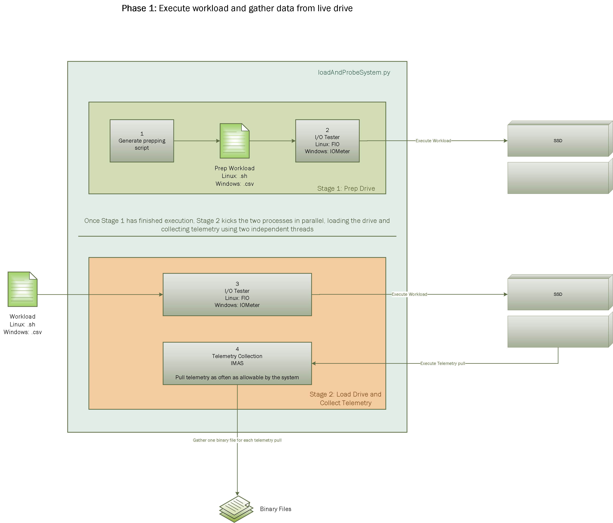
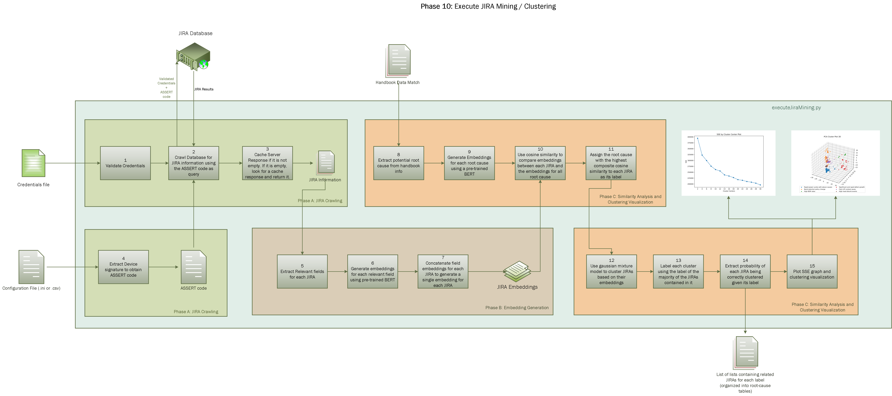

Rapid Automation and Analysis for Developers (RAAD) using Telemetry 2.0 User Guide
===================================================================================

J.Tarango, Et al., Application Number, Patent Title :
    - 20210191726, Methods And Apparatus For Continuous Monitoring Of Telemetry In The Field
    - 20210073632, Methods, Systems, Articles Of Manufacture, And Apparatus To Generate Code Semantics
    - 20210157512, Flexible Configuration Of Storage Device With Translation Language Set
    - 20200379687, Storage Device With Client Reconfigurable Protocol
    - 20190042129, Technologies For Adjusting The Performance Of Data Storage Devices Based On Telemetry Data
    - 20200226080, Solid State Drive With External Software Execution To Effect Internal Solid-state Drive Operations
    - Additional pending...

Introduction
------------
Title of Project: Pioneering Rapid Fault Analysis using Telemetry for Enhanced Customer Experience (R-FATE) for Solid State Drives

Summary
~~~~~~~
Telemetry is the state space snapshot which tightly-couples specialists to pertinent data, remotely, removing the cyber physical challenges with interacting on complex platforms. The immediate benefit is precise and rapid data extraction correlated to customer platforms. The purposeful subsequent benefit is proactive real-time analytics for monitoring of client platforms and data centers.

The topology to notify, extract, verify, tokenize, consolidate, and analyze data structures through an automated approach shipping on our products today. The real-time processing of the data enables data mining, machine learning, and artificial intelligence exploration.

In an adaptable commodity market, Intel’s® platform facilitates diligence across preceding barriers to accelerate innovation and time-to-market in an unprecedented tactical approach. The innovation within the storage interfaces from Intel’s® customer driven focus has catapulted an umbrella of methods and apparatuses focus on rapid development, platform stability, and collaborative early adoption of our state-of-the-art products. The initiatives have driven the prolific timeframes for Patent to Product seen in NSG’s history related to Solid-State-Drive (SSD) telemetry.

Opportunity/Problem
~~~~~~~~~~~~~~~~~~~
The cyber-physical, engineer resourcing, and availability limits the performing state to an average of 3 weeks for triage of the platform. The best known methods (BKM) for driving resolution requires Application Engineers (AEs) on site with a high probability of the device returned to Intel’s internal development teams. Furthermore, the BKM entails disjoint procedures for acquiring applicable logs, dumps, traces, etc. prone to human error not verifiable on site. The consequence associated to these events is large risk exposure time frames of fault, product delays, and affirmation dissociation of the Intel® Brand by customers.

When investigating the retrospectives of challenges, we can confirmed common basis is time-to-data (TTD). TTD is defined by determinate timeline from the fault appearance to the confirmation of adequate evidence to proceed a technical resolution strategy. Thus, TTD is the optimizable variable within the telemetry initiative. Telemetry is designed to be Intel’s remote method for a device to capture and save pertinent data. In general, telemetry is to be the BKM for fault analysis of anomaly events internally in ConVal, PV and externally in customer engagements. Telemetry does not do any analysis. The key ease of use is we no longer need to unlock the device since the access method is available through standard commands. Within Intel, we have streamlined through automation for the following: pulling, extracting, and parsing.

Solution
~~~~~~~~
The introduction of Intel telemetry enables the Meta data to be remotely captured and relayed to Intel through a standardized interface. Our proprietary intelligent instantiation ensures all pertinent Meta data is tailored for the signature observable by Telemetry. The topology reduces the customer engagement and data confirmation from a few weeks down to minutes. The advantage of our feature is it captures an internal state snapshot of previously volatile data at the time of failure. The locality and persistence of Meta data to the time of fault increases the probability of key operational behaviors correlated to the module, software, firmware, and/or component introducing the anomaly.

Capabilities
~~~~~~~~~~~~
RADD's approach is a scalable framework infrastructure to run workload, capture, extract, parse content, construct a unique profile signature, generate developer assistance graphs, cluster previous signatures in database tracking systems, simularity measure it to previous signatures, speculative root cause based on developer wiki pages, meta statistical/artificial intelligence model forecasting for incomplete meta, and generate comprehensive report.

Diagrams
~~~~~~~~

.. figure:: images/RAAD_Phase8.png

.. figure:: images/RAAD_Phase11.png

