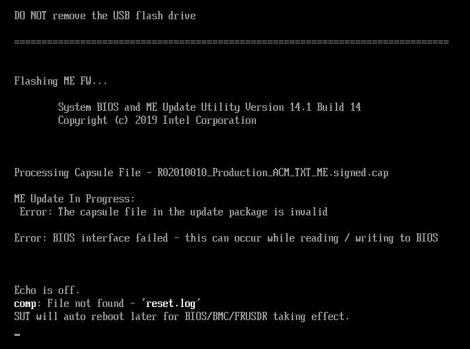

RAAD Server with Ubuntu 18+ x64_86 (Linux)
##########################################
The persistent memory server is online and ready for larger Artificial Intelligence/Machine Learning workloads. Users may need to supplement power (~350 Watts) for an Nvidia RTX A6000. The server power should be physically operated or through Intelligent Platform Management Interface (IPMI). We can check the control server by ssh with username@server. Lastly, the BIOs on the server can share the network through one port. Ideally, a user want to we have redundant ethernet cables in the case of one switch failing.

**Special Thanks to Steve Scargall (Intel)**

Server Platform Recommendation
==============================
2 Socket Wolfpass Server (Purley Platform) using the S2600WF motherboard CPU
    - Support Requires: Xeon Cascade Lake CPU 2nd generation Scalable
    - Recommended: Cascade Lake Platinum 8260L or 8280L
    - Note: CPUs without letters, some have the 'M' notation, and some are 'L'.  If there's no letter, that CPU supports up to 1TiB per socket (DDR+DCPMM) (Small), the 'M' (Medium) SKUs support up to 2TiB per socket, and the 'L' (Large) SKUs support up to 4.5TiB.  The T, V, and Y CPU SKUs have additional features that are unrelated to DCPMM.
DIMM Recommended Configurations
    - Minimum Required
        - 8 Optane per 1 DRAM
    - Configurations
        - 12 x DDR (16GB, 32GB, or 64GB)
        - 12 x DCPMM (128GB, 256GB, or 512GB)
    - Acutal
        - 1.5 TB Optane and 192 DRAM
Operating Systems:
    - Linux Recommendation: Kernel version 4.19 or later
    - Ubuntu 18.1x+ LTS
File Systems
    - Ext4
    - ZFS
Git Repos
    - https://github.com/intel/ipmctl

Training
========
- Explanation Video
    - https://software.intel.com/content/www/us/en/develop/videos/provisioning-intel-optane-dc-persistent-memory-modules-in-linux.html
- Supermicro Documentation
    - https://www.supermicro.com/support/resources/memory/DCPMM_1stGen_memory_config_purley.pdf

Memory Installation and Population
==================================
DDR4 and Intel Optane Persistent Memory must be installed in accordance with the memory population guidelines. Refer to the Intel Server Board S2600WF Product Family Technical Product Specification document for detailed information.
    - https://www.intel.com/content/dam/support/us/en/documents/server-products/server-boards/S2600WF_TPS.pdf

    .. figure:: images/Intel_S2600WF_DIMM_Slot_Locations.png

        Physical memory slot identifiers

    .. figure:: images/Intel_S2600WF_DDR_Population_Matrix.png

        Memory slot population when using only DDR4 memory. The table shows a single CPU socket population matrix. It is highly recommended to install memory using the same population across all CPU sockets in the system.

    .. figure:: images/Intel_S2600WF_DDR_and_PMem_Population_Matrix.png

        Shows the memory slot population matrix when using DDR4 and Intel Optane Persistent Memory modules. The table shows a single CPU socket population matrix. It is highly recommended to install memory using the same population across all CPU sockets in the system.

A fully populated system (2-2-2) should install DDR into Slot 1 (Blue) and Optane PMem in Slot 2 (Black) of every memory channel. A correctly installed configuration should have a population with the following (DDR/PMem capacity does not matter):

    .. code-block::

        $ ipmctl show -topology
         DimmID | MemoryType | Capacity | PhysicalID| DeviceLocator
        ================================================================================
         0x0001 | Logical Non-Volatile Device | 252.438 GiB | 0x0026 | CPU1_DIMM_A2
         0x0011 | Logical Non-Volatile Device | 252.438 GiB | 0x0028 | CPU1_DIMM_B2
         0x0021 | Logical Non-Volatile Device | 252.438 GiB | 0x002a | CPU1_DIMM_C2
         0x0101 | Logical Non-Volatile Device | 252.438 GiB | 0x002c | CPU1_DIMM_D2
         0x0111 | Logical Non-Volatile Device | 252.438 GiB | 0x002e | CPU1_DIMM_E2
         0x0121 | Logical Non-Volatile Device | 252.438 GiB | 0x0030 | CPU1_DIMM_F2
         0x1001 | Logical Non-Volatile Device | 252.438 GiB | 0x0032 | CPU2_DIMM_A2
         0x1011 | Logical Non-Volatile Device | 252.438 GiB | 0x0034 | CPU2_DIMM_B2
         0x1021 | Logical Non-Volatile Device | 252.438 GiB | 0x0036 | CPU2_DIMM_C2
         0x1101 | Logical Non-Volatile Device | 252.438 GiB | 0x0038 | CPU2_DIMM_D2
         0x1111 | Logical Non-Volatile Device | 252.438 GiB | 0x003a | CPU2_DIMM_E2
         0x1121 | Logical Non-Volatile Device | 252.438 GiB | 0x003c | CPU2_DIMM_F2
         N/A | DDR4 | 32.000 GiB | 0x0025 | CPU1_DIMM_A1
         N/A | DDR4 | 32.000 GiB | 0x0027 | CPU1_DIMM_B1
         N/A | DDR4 | 32.000 GiB | 0x0029 | CPU1_DIMM_C1
         N/A | DDR4 | 32.000 GiB | 0x002b | CPU1_DIMM_D1
         N/A | DDR4 | 32.000 GiB | 0x002d | CPU1_DIMM_E1
         N/A | DDR4 | 32.000 GiB | 0x002f | CPU1_DIMM_F1
         N/A | DDR4 | 32.000 GiB | 0x0031 | CPU2_DIMM_A1
         N/A | DDR4 | 32.000 GiB | 0x0033 | CPU2_DIMM_B1
         N/A | DDR4 | 32.000 GiB | 0x0035 | CPU2_DIMM_C1
         N/A | DDR4 | 32.000 GiB | 0x0037 | CPU2_DIMM_D1
         N/A | DDR4 | 32.000 GiB | 0x0039 | CPU2_DIMM_E1
         N/A | DDR4 | 32.000 GiB | 0x003b | CPU2_DIMM_F1

Updating the BIOS and Intel Optane Persistent Memory Firmware
=============================================================
1. This procedure is for Intel whitebox servers only (aka Wolfpass).  This will not work on OEM systems.
#. Use a FAT32 formatted USB stick/thumb drive to store BIOS image.
#. If the USB drive is local to your laptop/desktop and will be inserted into the remote server after creating the USB drive, perform steps 2a-2d. If the server is remote with a USB drive inserted, perform steps 2e-2k.
#. If the system is currently running a pre-production or debug bios, you must put the system in the BIOS Recovery mode otherwise you'll end up with errors similar to those shown in Figure 1. If it running a production BIOS and we are simply updating it, skip the BIOS recovery mode step.
#. A production BIOS version is 02.01.0001 or later, eg: SE5C620.86B.02.01.0010.010620200716

How To enter BIOS Recovery Mode
===============================
To put the system into BIOS Recovery mode do the following:
    - Disconnect AC, move the white jumper J5A3 (BIOS_RCVR), and black jumper J5A4 (ME_FCR_UPDT), behind the video connector, from 1-2 to 2-3.
    - Power the system up, it will boot to recovery mode
    - Press F6 to enter the Boot Manager at boot time
    - Select 'Launch EFI Shell' from the list
    - At UEFI Shell, run the update scripts from the BIOS package (See 'BIOS ad Firmware Update Procedure' section)
    - When done, disconnect AC, move both jumpers J5A3 and J5A4 back to 1-2
    - Boot the system normally

BIOS and Firmware Update Procedure
==================================
1. Download the latest zip file for Production servers from https://downloadcenter.intel.com/download/29341/Intel-Server-Board-S2600WF-Family-BIOS-and-Firmware-Update-Package-for-UEFI
#. If the USB is to be created locally on a laptop/desktop then inserted into the target system:

    - Format the USB Drive using FAT32
    - Unzip the BIOS package
    - Copy the contents to the root of the USB drive
    - Remove the USB Drive and insert into the target system
    - Else, if the USB drive is already inserted into the target system, perform the following:
        - Copy the zip file to the target system (we'll assume to /downloads for this procedure)
        - Unzip the file, eg:
        - $ unzip S2600WF_EFI_BIOSR02010010_ME04.01.04.339_BMC2.37.1f190479_FRUSDR_1.98_DCPMM01.02.00.5417.zip
        - Identify the USB drive (Assumes /dev/sde as an example)
        .. code-block::

            $ lsblk -l
            NAME                 MAJ:MIN RM   SIZE RO TYPE MOUNTPOINT
            sde                    8:64   1  29.9G  0 disk

        - Remove any existing partitions
        .. code-block::

            $ wipefs -a /dev/sde

        - Format the USB Drive using Fat32 (vfat):
        .. code-block::

            $ mkfs.vfat -F32 /dev/sde

        - Mount the USB Drive

        .. code-block::

            $ mkdir /mnt/usbdrive
            $ mount -t vfat /dev/sde /mnt/usbdrive
        - Copy the contents of the ZIP file to the USB Drive

        .. code-block::

            $ cd /downloads/S2600WF_EFI_BIOSR02010010_ME04.01.04.339_BMC2.37.1f190479_FRUSDR_1.98_DCPMM01.02.00.5417/
            $ cp -rp * /mnt/usbdrive
            $ sync
            $ umount /mnt/usbdrive

#. Connect to the server through the BMC (or serial)
#. Insert the USB stick into the target server & reboot
#. When you see the BIOS , press F6 to enter the Boot Manager and select “Launch EFI Shell” from the list:

    .. figure:: images/S002.png

#. If the BIOS/Firmware image contents are located in the root of the USB, the BIOS should execute the 'startup.nsh' script located in the root directory.
    - If the BIOS/Firmware image contents are located in a directory on the USB Drive:
        - Select the USB Drive. This will usually be 'FS0:' or 'FS1'
        - From the prompt, type 'FS0:' (without quotes. The colon is important)
        - Change directory to the folder with the BIOS/Firmware image, eg

        .. code-block::

            > cd WFP_SUP_WW37

        - List the contents and verify the 'startup.nsh' script is available

        .. code-block::

            > ls

        - Execute the 'startup.nsh' script

        .. code-block::

            > startup.nsh

#. After a short initialization phase, the script will stop and prompt for input.  It shows the 6 steps and requests for you to press any key to continue
#. Steps 1-5 will be performed.

    - Note: If you connect through the BMC web interface or SSH, the screen may go black and you will lose connection.  This is because the BMC update restarts all connections.  Just close your session/window and re-connect.
#. The script will then ask you to update the SDR and FRU.

    - Select option 3 from the list.
    - Note: You may see 'FRU Board P/N is invalid!' which is okay
#. When the update completes, the system will automatically reboot.
#. Let the system boot to allow the firmware updates to complete.  Note: The system may reboot several times within the BIOS before it actually tries to boot into the OS.  This is okay.
#. [Optional] If DCPMM is being installed or reconfigured, power off the host and physically install the DDR & DCPMM Memory.  Otherwise, skip to Step 18

    - For my 2S 2U Wolfpass, DCPMM is installed in the Black DIMM Slots - CPU[12]_DIMM_[A-F]2 and the DDR in the *1 slots (Blue DIMM Slots).  There should be a DIMM location diagram on the top of the server to verify this before installing.  Here's the topology output from my lab system so you can map the DCPMM and DDR slot locations:
    .. code-block::

        $ ipmctl show -topology
        DimmID | MemoryType                  | Capacity  | PhysicalID| DeviceLocator
        0x0001 | Logical Non-Volatile Device | 252.4 GiB | 0x0028    | CPU1_DIMM_A2
        0x0011 | Logical Non-Volatile Device | 252.4 GiB | 0x002c    | CPU1_DIMM_B2
        0x0021 | Logical Non-Volatile Device | 252.4 GiB | 0x0030    | CPU1_DIMM_C2
        0x0101 | Logical Non-Volatile Device | 252.4 GiB | 0x0036    | CPU1_DIMM_D2
        0x0111 | Logical Non-Volatile Device | 252.4 GiB | 0x003a    | CPU1_DIMM_E2
        0x0121 | Logical Non-Volatile Device | 252.4 GiB | 0x003e    | CPU1_DIMM_F2
        0x1001 | Logical Non-Volatile Device | 252.4 GiB | 0x0044    | CPU2_DIMM_A2
        0x1011 | Logical Non-Volatile Device | 252.4 GiB | 0x0048    | CPU2_DIMM_B2
        0x1021 | Logical Non-Volatile Device | 252.4 GiB | 0x004c    | CPU2_DIMM_C2
        0x1101 | Logical Non-Volatile Device | 252.4 GiB | 0x0052    | CPU2_DIMM_D2
        0x1111 | Logical Non-Volatile Device | 252.4 GiB | 0x0056    | CPU2_DIMM_E2
        0x1121 | Logical Non-Volatile Device | 252.4 GiB | 0x005a    | CPU2_DIMM_F2
        N/A    | DDR4                        | 32.0 GiB  | 0x0026    | CPU1_DIMM_A1
        N/A    | DDR4                        | 32.0 GiB  | 0x002a    | CPU1_DIMM_B1
        N/A    | DDR4                        | 32.0 GiB  | 0x002e    | CPU1_DIMM_C1
        N/A    | DDR4                        | 32.0 GiB  | 0x0034    | CPU1_DIMM_D1
        N/A    | DDR4                        | 32.0 GiB  | 0x0038    | CPU1_DIMM_E1
        N/A    | DDR4                        | 32.0 GiB  | 0x003c    | CPU1_DIMM_F1
        N/A    | DDR4                        | 32.0 GiB  | 0x0042    | CPU2_DIMM_A1
        N/A    | DDR4                        | 32.0 GiB  | 0x0046    | CPU2_DIMM_B1
        N/A    | DDR4                        | 32.0 GiB  | 0x004a    | CPU2_DIMM_C1
        N/A    | DDR4                        | 32.0 GiB  | 0x0050    | CPU2_DIMM_D1
        N/A    | DDR4                        | 32.0 GiB  | 0x0054    | CPU2_DIMM_E1
        N/A    | DDR4                        | 32.0 GiB  | 0x0058    | CPU2_DIMM_F1

#. Power on the host.  Note: The system can take a VERY long time to get past the CPU and Memory Initialization.  Perhaps up to 10mins on the 6TB (512GB) system.
#. Assuming no issues, let the system boot into the OS to verify no issues are encountered with the new hardware
#. Assuming no issues, reboot the host and go back in to the UEFI Shell (F6 during the BIOS screen) [Repeat Step 7]
#. From the UEFI Shell prompt, change to the USB Drive using 'fs0:' (Note: the colon is important!) [Repeat Step 8]

    .. code-block::

        Shell>  fs0:

    (This could also be 'fs1:' depending on the number of drives)

#. You should see the 'WFP_SUP_WW37' directory [Repeat Step 9]
    .. code-block::

        FS0:> ls
        WFP_SUP_WW37
        > cd WFP_SUP_WW37

#. Run the 'startup.nsh' script located in the directory [Repeat Step 10]
    .. code-block::

        FS0:\WFP_SUP_WW37\> startup.nsh

#. This will detect that Steps 1-5 have been completed and will proceed with Step 6 (Update DCPMM Firmware)

    .. figure:: images/S003.png

    - Note: If the script bails out with an error that the logs do not match, you can fix this using 'echo 1 > reset.log' then re-run 'startup.nsh' as show below:

    .. figure:: images/S004.png

#. Once successful, you should be returned to the UEFI Shell prompt

    .. figure:: images/S005.png

#. Type 'reset -c' to reset the host and clear the CMOS
#. Press F2 to enter the BIOS setup.  Clearing the CMOS often resets the date/time so we need to fix this before allowing the OS to boot.  The date/time settings are in the 'Main' menu of the BIOS (the default selected option).

    .. figure:: images/S006.png

#. Press F10 to save the changes and exit the BIOS
#. Allow the system to boot in to the OS
#. End of action plan.

Compatible Operating Systems for Intel® Optane™ Persistent Memory
=================================================================
Intel® Optane™ persistent memory operating system (OS) mode support information.

    - The operating systems listed below have been verified by Intel and do not reflect the OS vendor support.
    - Please contact the respective OS vendor(s) for the exact release version providing the proper support.
    - For OS that are not listed, use open source code to generate necessary files.

Operating System Support
------------------------

======================================================= ======= =============== ==============
OS Version                                              Memory  Mode App Direct Mode Dual Mode
======================================================= ======= =============== ==============
RHEL* 7.5                                               Yes
Ubuntu* 16.04 LTS                                       Yes
Windows* Server 2016                                    Yes
Oracle* Linux* 7.6 with UEK R5 Update 2	                Yes     Yes
VMware* vSphere 6.7 EP10                                Yes     Yes
CentOS* 7.6 or later                                    Yes     Yes             Yes
RHEL 7.6 or later                                       Yes     Yes             Yes
SLES* 12 SP4 or later	                                Yes     Yes             Yes
SLES 15 or later                                        Yes     Yes             Yes
Ubuntu 18.04 LTS                                        Yes     Yes             Yes
Ubuntu 18.1+ LTS                                        Yes     Yes             Yes
VMWare* ESXi 6.7 U1 or later                            Yes     Yes             Yes
Windows 10 Pro for Workstation Version 1809 or later	Yes     Yes             Yes
Windows Server 2019 or later	                        Yes     Yes             Yes
======================================================= ======= =============== ==============

Platform Details
===========================================

Intel® Xeon® Platinum 8260L CPU & Optane™ DC 512GB Persistent Memory Supermicro 2U/4S 64GB {AEP}

    - Processors 4 x Intel® Xeon® Platinum 8260L Processor (35.75M Cache, 2.40 GHz)
    - Memory 24 x 64GB 2933MHz PC4-23400 ECC Registered 1.2 Volts DDR4 DIMM
    - Memory 24 x 512GB Apache Pass 3D XPoint Persistent Memory DIMM [NMA1XXD512GPSU4]
    - Storage 1 x 240GB Intel® SSD DC S4510 Series (Youngsville Refresh) SATA 6Gb/s 2.5"
    - Video Adapter 1 x Aspeed AST2500 On-Board
    - Remote Management 1 x SuperMicro Intelligent Management (IPMI 2.0)
    - Operating System 1 x Ubuntu 18.1x+ LTS
    - Power Supplies 2 x 1600 Watts Hot-Swappable 110/220v
    - Rails 1 x Supermicro Ball bearing Rails MCP-290-00057-0N [In Box]
    - Add-in Adapter 1 x Intel® Ethernet Converged Network Adapter X550-T2 10Gbe Dual-Port
    - Onboard Adapter 1 x Intel® i350 1Gbe NIC on SuperMicro AOC-2UR66-i4G Riser Quad-Port

The model of system is:

    - Supermicro SYS-2049U-TR4

SuperMicro Site

    - https://www.supermicro.com/en/products/system/2U/2049/SYS-2049U-TR4.cfm
    - https://www.supermicro.com/products/system/2U/2029/SYS-2029U-TN24R4T.cfm
    - S/N: WO99274L02S004
    - Model: 218U-16
    - P/N: SYS-2049U-TR4
    - PCODE: 2049U-TR4-IDD
    - OS SATA drive: Intel D3-S4510 Series 240GB  ISN: BTYF918004B4240AGN
    - Note: units configuration will support 12 SATA3 (6Gbps) and 4 x U.2 Intel NVMe SSD NVMe drives in PCIe Slots only.

    .. figure:: images/S007.png

        Persistent Memory with direct access (DAX)

How to optimize Optane DIMM usage for DRAM Caching
==================================================
**Memkind**: is a persistent memory mapped files aware to the file system. Details of using it https://software.intel.com/en-us/articles/volatile-use-of-persistent-memory

**libvmemcache**: is an embeddable and lightweight in-memory caching solution. It's designed to fully take advantage of large capacity memory, such as Persistent Memory with direct access (DAX), through memory mapping in an efficient and scalable way. Details of using it https://docs.pmem.io/persistent-memory/getting-started-guide/what-is-pmdk

Technical Details
=================
1. Introduction to Persistent Memory Programming
    - https://software.intel.com/en-us/articles/introduction-to-programming-with-persistent-memory-from-intel
#. DIMM usage: Overview information
    - Brief https://www.intel.com/content/www/us/en/products/docs/memory-storage/optane-persistent-memory/optane-dc-persistent-memory-brief.html
    - Quick Start https://www.intel.com/content/dam/support/us/en/documents/memory-and-storage/data-center-persistent-mem/Intel-Optane-DC-Persistent-Memory-Quick-Start-Guide.pdf
    - Configurations for optimized performance https://www.intel.com/content/dam/support/us/en/documents/memory-and-storage/intel-mdt-setup-guide.pdf
#. Software
    - Caching Software: Focuses on how to cache SSDs and potentially app direct mode servers
        - https://open-cas.github.io/index.html
    - Storage Performance Development Kit – This is the intel supported development kit to support optimizing transactions.
        - https://spdk.io/doc/
    - Distributed Object Storage Software (DAOS) Storage software stack to accelerate
        - https://www.intel.com/content/dam/www/public/us/en/documents/solution-briefs/high-performance-storage-brief.pdf
    - Publication on academic studies of Optane DIMMs
        - Academic paper on Optane DIMMs Basic Information
            - https://arxiv.org/pdf/1903.05714.pdf
        - Optimizing Optane DIMMs Transactions
            - http://www.cse.lehigh.edu/~spear/papers/zardoshti-ipdps-2020.pdf
        - C++ LLVM transactions light weight support
            - http://www.cse.lehigh.edu/~spear/papers/zardoshti-taco-2019.pdf

Ubuntu 18.1x+ LTS x86_64 Instructions
======================================
Operating system SATA SSD is to be partitioned in ext4 with the additional storage configured in ZFS pools. The Intel NVDIMM SW stack implements several aspects to enable NVDIMM:
    - nvdimm driver[12]
    - Direct Access (DAX) support with file system[14]
    - Block Translation Table (BTT)[15]
    - UEFI Human Interface Infrastructure (HII) Firmware
    - ndctl[16]: Utility library for managing the libnvdimm (non-volatile memory device) sub-system in the Linux kernel
    - ipmctl[17]: Utility for configuring and managing Intel Optane DC persistent memory modules

Install Commands
-----------------

.. code-block::

    $ sudo add-apt-repository ppa:woodrow-shen/ppa
    $ sudo apt-get update
    $ sudo apt install -y ipmctl libipmctl-dev ledmon ndctl zfs-initramfs zfsutils-linux zfs-initramfs libzfslinux-dev zfs-auto-snapshot libvirt-daemon-driver-storage-zfs python3-pyzfs pyzfs-doc golang-go-zfs-dev libgtk-3-dev golang git nfs-common golang-github-gotk3-gotk3-dev btrfs-progs e2fsprogs f2fs-tools dosfstools hfsutils hfsprogs jfsutils mdadm util-linux cryptsetup dmsetup lvm2 util-linux nilfs-tools nilfs-tools ntfs-3g ntfs-3g reiser4progs reiserfsprogs reiserfsprogs udftools xfsprogs xfsdump gpart gedit samba rsync grsync rar unrar p7zip-full p7zip-rar openconnect libncurses5 libtinfo5 libz1 openvpn vpnc-scripts net-tools network-manager-openvpn network-manager-l2tp-gnome postfix libsasl2-modules ca-certificates mailutils ubuntu-mate-desktop mate-desktop-environment-extras mate-tweak gnome-tweaks wine
    $ wget https://www.thawte.com/roots/thawte_Premium_Server_CA.pem
    $ sudo mv thawte_Premium_Server_CA.pem /etc/ssl/certs/Thawte_Premium_Server_CA.pem
    $ sudo cat /etc/ssl/certs/Thawte_Premium_Server_CA.pem | sudo tee -a /etc/postfix/cacert.pem
    $ sudo apt-get upgrade -y

Performance Optimizations
-------------------------

.. code-block::

    # Do not use ext3 for the OS file system, use ext4!
    $ sudo preload cpupower-gui indicator-cpufreq sysv-rc-conf numad

.. code-block::

    # Modify the cpu power to be for performance
    $ sudo sysctl vm.swappiness=1
    $ swapoff -a

.. code-block::

    # Wait  20 minutes...
    $ swapon -a

.. code-block::

    $ sudo gedit /etc/sysctl.conf
    # Modify or add the value
        vm.swappiness=10
        vm.vfs_cache_pressure=50
        vm.dirty_background_ratio = 5
        vm.dirty_background_bytes = 0
        vm.dirty_ratio = 10
        vm.dirty_bytes = 0
        vm.dirty_writeback_centisecs = 500
        vm.dirty_expire_centisecs = 12000

.. code-block::

    $ sudo gedit /etc/fstab
    # Add the following:
        # Move /tmp to RAM
        tmpfs /tmp tmpfs defaults,noexec,nosuid 0 0

.. code-block::

    $ sudo ufw logging off
    $ sudo chmod +x /etc/rc.local

.. code-block::

    $ sudo gedit /etc/rc.local
    # Add this above "exit 0", we want these to reflect the performance of the media read-write Input-Output size.
    # Please refer to [24] and domain expert for internal mechanics of the storage device. The 'sda' is the disk location in Linux.
    echo 0 > /sys/block/sda/queue/add_random
    echo 0 > /sys/block/sda/queue/rotational
    echo 2 > /sys/block/sda/queue/rq_affinity
    echo 256 > /sys/block/sda/queue/nr_requests
    echo 256 > /sys/block/sda/queue/read_ahead_kb
    exit 0

.. code-block::

    $ sudo /etc/pam.d/common-session and /etc/pam.d/common-session-noninteractive
    # Add
    session required pam_limits.so
    # The total size should be a reflection of total system memory with room for the operating system and background tasks.
    # These are in KB for the file so ensure you convert properly.
    # Note: the user is @perf refers to the performance user group and user_ID is for a specific user. The '-' means soft=hard limit.
    # Ensure the system is calculated and configured for total users by ensuring swap space is ready for all users operating at peak usage.
    # In our case we have, 24 units x 1 DIMM x 64 GB per DRAM  = 1,536 GB DRAM and 6 units x 4 DIMMs x 512 GB per Optane DIMM = 12,288 GB.
    # Total runtime memory is 13,824 GB ~ 13.8 TB.
    # We will limit the average user to the floor power of two for the DRAM size so:
    #  T = 1,536 GB ~= (1,536 * 1,048,576 KB) ~= 1610612736 KB
    #  log(1610612736)/log(2) ~= 30.5
    #  floor(30.5) ~= 30, (2^30)-1 = 1073741823, we subtract 1 for unsigned Linux kernel representation.
    # Note: the Linux kernel variable size is the limit, so for developers check the value in the source code.
    #       nofile is based on cat /proc/sys/fs/nr_open
    user_ID soft nofile 32768
    user_ID hard nofile 32768
    user_ID soft fsize 1073741823
    user_ID hard fsize 1073741823
    user_ID soft data 1073741823
    user_ID hard data 1073741823
    user_ID soft stack 1073741823
    user_ID hard stack 1073741823
    user_ID soft rss 1073741823
    user_ID hard rss 1073741823
    user_ID soft core 1073741823
    user_ID hard core 1073741823

    @perf soft nofile 1048576
    @perf hard nofile 1048576
    @perf soft fsize unlimited
    @perf hard fsize unlimited
    @perf soft data unlimited
    @perf hard data unlimited
    @perf soft stack unlimited
    @perf hard stack unlimited
    @perf soft rss unlimited
    @perf hard rss unlimited
    @perf soft core unlimited
    @perf hard core unlimited
    @perf soft cpu unlimited
    @perf hard cpu unlimited
    @perf hard as unlimited
    @perf soft as unlimited
    @perf soft locks unlimited
    @perf hard locks unlimited
    @perf soft memlock unlimited
    @perf hard memlock unlimited
    @perf  soft memlock unlimited
    @perf  hard memlock unlimited

.. code-block::

    $ sudo gedit /etc/security/limits.conf
    $ sudo gedit /etc/sysctl.conf
    # Add following:
    fs.file-max = 2097152
    # Run:

.. code-block::

    sysctl -p

Additional References
---------------------
    - Load balance https://github.com/google/seesaw
    - Go between balance http://gobetween.io/downloads.html
    - Ngix balance https://upcloud.com/community/tutorials/configure-load-balancing-nginx/

Packages
--------

Latex
^^^^^
    .. code-block::

        jtarango@Telemetry-Bench-0:~$ sudo apt-get install texlive-pictures texlive-science texlive-latex-extra imagemagick -y

Bulk install
^^^^^^^^^^^^
    .. code-block::

        jtarango@Telemetry-Bench-0:~$ sudo apt-get update
        jtarango@Telemetry-Bench-0:~$ dpkg --clear-selections
        jtarango@Telemetry-Bench-0:~$ sudo dpkg --set-selections < list.txt

File: `list.txt` with file content below
^^^^^^^^^^^^^^^^^^^^^^^^^^^^^^^^^^^^^^^^^
.. code-block::

    accountsservice					install
    acl						install
    acpi-support					install
    acpid						install
    adduser						install
    adium-theme-ubuntu				install
    adwaita-icon-theme				install
    aisleriot					install
    alsa-base					install
    alsa-utils					install
    anacron						install
    apg						install
    app-install-data-partner			install
    apparmor					install
    apport						install
    apport-gtk					install
    apport-symptoms					install
    appstream					install
    apt						install
    apt-config-icons				install
    apt-utils					install
    aptdaemon					install
    aptdaemon-data					install
    aptitude					install
    aptitude-common					install
    apturl						install
    apturl-common					install
    aspell						install
    aspell-en					install
    at						install
    at-spi2-core					install
    autoconf					install
    automake					install
    autotools-dev					install
    avahi-autoipd					install
    avahi-daemon					install
    avahi-utils					install
    baobab						install
    base-files					install
    base-passwd					install
    bash						install
    bash-completion					install
    bc						install
    bind9-host					install
    binutils					install
    binutils-common:amd64				install
    binutils-x86-64-linux-gnu			install
    bison						install
    blt						install
    bluez						install
    bluez-cups					install
    bluez-obexd					install
    bolt						install
    branding-ubuntu					install
    brltty						install
    bsdmainutils					install
    bsdutils					install
    bubblewrap					install
    build-essential					install
    busybox-initramfs				install
    busybox-static					install
    byobu						install
    bzip2						install
    bzip2-doc					install
    ca-certificates					install
    ccache						install
    cheese						install
    cheese-common					install
    chromium-codecs-ffmpeg-extra			install
    cifs-utils					install
    cmake						install
    cmake-data					install
    colord						install
    colord-data					install
    command-not-found				install
    command-not-found-data				install
    console-setup					install
    console-setup-linux				install
    coreutils					install
    cpio						install
    cpp						install
    cpp-7						install
    cracklib-runtime				install
    crda						install
    cron						install
    cups						install
    cups-browsed					install
    cups-bsd					install
    cups-client					install
    cups-common					install
    cups-core-drivers				install
    cups-daemon					install
    cups-filters					install
    cups-filters-core-drivers			install
    cups-ipp-utils					install
    cups-pk-helper					install
    cups-ppdc					install
    cups-server-common				install
    dash						install
    dbus						install
    dbus-user-session				install
    dbus-x11					install
    dc						install
    dconf-cli					install
    dconf-gsettings-backend:amd64			install
    dconf-service					install
    dctrl-tools					install
    debconf						install
    debconf-i18n					install
    debianutils					install
    deja-dup					install
    desktop-file-utils				install
    device-tree-compiler				install
    devscripts					install
    dfu-util					install
    dh-python					install
    dictionaries-common				install
    diffstat					install
    diffutils					install
    dirmngr						install
    distro-info-data				install
    dmeventd					install
    dmidecode					install
    dmsetup						install
    dmz-cursor-theme				install
    dns-root-data					install
    dnsmasq-base					install
    dnsutils					install
    docbook-xml					install
    dosfstools					install
    doxygen						install
    dpkg						install
    dpkg-dev					install
    dput						install
    e2fsprogs					install
    ed						install
    efibootmgr					install
    eject						install
    emacsen-common					install
    enchant						install
    eog						install
    espeak-ng-data:amd64				install
    evince						install
    evince-common					install
    evolution-data-server				install
    evolution-data-server-common			install
    example-content					install
    fail2ban					install
    fakeroot					install
    fdisk						install
    file						install
    file-roller					install
    findutils					install
    fio						install
    firefox						install
    firefox-locale-en				install
    flex						install
    fontconfig					install
    fontconfig-config				install
    fonts-beng					install
    fonts-beng-extra				install
    fonts-dejavu-core				install
    fonts-deva					install
    fonts-deva-extra				install
    fonts-droid-fallback				install
    fonts-freefont-ttf				install
    fonts-gargi					install
    fonts-gubbi					install
    fonts-gujr					install
    fonts-gujr-extra				install
    fonts-guru					install
    fonts-guru-extra				install
    fonts-indic					install
    fonts-kacst					install
    fonts-kacst-one					install
    fonts-kalapi					install
    fonts-khmeros-core				install
    fonts-knda					install
    fonts-lao					install
    fonts-liberation				install
    fonts-liberation2				install
    fonts-lklug-sinhala				install
    fonts-lohit-beng-assamese			install
    fonts-lohit-beng-bengali			install
    fonts-lohit-deva				install
    fonts-lohit-gujr				install
    fonts-lohit-guru				install
    fonts-lohit-knda				install
    fonts-lohit-mlym				install
    fonts-lohit-orya				install
    fonts-lohit-taml				install
    fonts-lohit-taml-classical			install
    fonts-lohit-telu				install
    fonts-lyx					install
    fonts-mlym					install
    fonts-nakula					install
    fonts-navilu					install
    fonts-noto-cjk					install
    fonts-noto-color-emoji				install
    fonts-noto-mono					install
    fonts-opensymbol				install
    fonts-orya					install
    fonts-orya-extra				install
    fonts-pagul					install
    fonts-sahadeva					install
    fonts-samyak-deva				install
    fonts-samyak-gujr				install
    fonts-samyak-mlym				install
    fonts-samyak-taml				install
    fonts-sarai					install
    fonts-sil-abyssinica				install
    fonts-sil-padauk				install
    fonts-smc					install
    fonts-smc-anjalioldlipi				install
    fonts-smc-chilanka				install
    fonts-smc-dyuthi				install
    fonts-smc-karumbi				install
    fonts-smc-keraleeyam				install
    fonts-smc-manjari				install
    fonts-smc-meera					install
    fonts-smc-rachana				install
    fonts-smc-raghumalayalamsans			install
    fonts-smc-suruma				install
    fonts-smc-uroob					install
    fonts-taml					install
    fonts-telu					install
    fonts-telu-extra				install
    fonts-thai-tlwg					install
    fonts-tibetan-machine				install
    fonts-tlwg-garuda				install
    fonts-tlwg-garuda-ttf				install
    fonts-tlwg-kinnari				install
    fonts-tlwg-kinnari-ttf				install
    fonts-tlwg-laksaman				install
    fonts-tlwg-laksaman-ttf				install
    fonts-tlwg-loma					install
    fonts-tlwg-loma-ttf				install
    fonts-tlwg-mono					install
    fonts-tlwg-mono-ttf				install
    fonts-tlwg-norasi				install
    fonts-tlwg-norasi-ttf				install
    fonts-tlwg-purisa				install
    fonts-tlwg-purisa-ttf				install
    fonts-tlwg-sawasdee				install
    fonts-tlwg-sawasdee-ttf				install
    fonts-tlwg-typewriter				install
    fonts-tlwg-typewriter-ttf			install
    fonts-tlwg-typist				install
    fonts-tlwg-typist-ttf				install
    fonts-tlwg-typo					install
    fonts-tlwg-typo-ttf				install
    fonts-tlwg-umpush				install
    fonts-tlwg-umpush-ttf				install
    fonts-tlwg-waree				install
    fonts-tlwg-waree-ttf				install
    fonts-ubuntu					install
    foomatic-db-compressed-ppds			install
    friendly-recovery				install
    ftp						install
    fuse						install
    fwupd						install
    fwupdate					install
    fwupdate-signed					install
    g++						install
    g++-7						install
    gawk						install
    gcc						install
    gcc-7						install
    gcc-7-base:amd64				install
    gcc-7-multilib					install
    gcc-8-base:amd64				install
    gcc-multilib					install
    gcr						install
    gdb						install
    gdbserver					install
    gdisk						install
    gdm3						install
    gedit						install
    gedit-common					install
    genisoimage					install
    geoclue-2.0					install
    geoip-database					install
    gettext						install
    gettext-base					install
    ghostscript					install
    ghostscript-x					install
    gir1.2-accountsservice-1.0			install
    gir1.2-atk-1.0:amd64				install
    gir1.2-atspi-2.0:amd64				install
    gir1.2-dbusmenu-glib-0.4:amd64			install
    gir1.2-dee-1.0					install
    gir1.2-freedesktop:amd64			install
    gir1.2-gck-1:amd64				install
    gir1.2-gcr-3:amd64				install
    gir1.2-gdesktopenums-3.0:amd64			install
    gir1.2-gdkpixbuf-2.0:amd64			install
    gir1.2-gdm-1.0					install
    gir1.2-geoclue-2.0:amd64			install
    gir1.2-geocodeglib-1.0:amd64			install
    gir1.2-glib-2.0:amd64				install
    gir1.2-gmenu-3.0:amd64				install
    gir1.2-gnomebluetooth-1.0:amd64			install
    gir1.2-gnomedesktop-3.0:amd64			install
    gir1.2-goa-1.0:amd64				install
    gir1.2-gst-plugins-base-1.0:amd64		install
    gir1.2-gstreamer-1.0:amd64			install
    gir1.2-gtk-3.0:amd64				install
    gir1.2-gtksource-3.0:amd64			install
    gir1.2-gudev-1.0:amd64				install
    gir1.2-gweather-3.0:amd64			install
    gir1.2-harfbuzz-0.0:amd64			install
    gir1.2-ibus-1.0:amd64				install
    gir1.2-javascriptcoregtk-4.0:amd64		install
    gir1.2-json-1.0:amd64				install
    gir1.2-mutter-2:amd64				install
    gir1.2-nm-1.0:amd64				install
    gir1.2-nma-1.0:amd64				install
    gir1.2-notify-0.7:amd64				install
    gir1.2-packagekitglib-1.0			install
    gir1.2-pango-1.0:amd64				install
    gir1.2-peas-1.0:amd64				install
    gir1.2-polkit-1.0				install
    gir1.2-rb-3.0:amd64				install
    gir1.2-rsvg-2.0:amd64				install
    gir1.2-secret-1:amd64				install
    gir1.2-snapd-1:amd64				install
    gir1.2-soup-2.4:amd64				install
    gir1.2-totem-1.0:amd64				install
    gir1.2-totemplparser-1.0:amd64			install
    gir1.2-udisks-2.0:amd64				install
    gir1.2-unity-5.0:amd64				install
    gir1.2-upowerglib-1.0:amd64			install
    gir1.2-vte-2.91:amd64				install
    gir1.2-webkit2-4.0:amd64			install
    gir1.2-wnck-3.0:amd64				install
    git						install
    git-man						install
    gjs						install
    gkbd-capplet					install
    glances						install
    glib-networking:amd64				install
    glib-networking-common				install
    glib-networking-services			install
    gnome-accessibility-themes			install
    gnome-bluetooth					install
    gnome-calendar					install
    gnome-control-center				install
    gnome-control-center-data			install
    gnome-control-center-faces			install
    gnome-desktop3-data				install
    gnome-disk-utility				install
    gnome-font-viewer				install
    gnome-getting-started-docs			install
    gnome-initial-setup				install
    gnome-keyring					install
    gnome-keyring-pkcs11:amd64			install
    gnome-mahjongg					install
    gnome-menus					install
    gnome-mines					install
    gnome-online-accounts				install
    gnome-power-manager				install
    gnome-screenshot				install
    gnome-session-bin				install
    gnome-session-canberra				install
    gnome-session-common				install
    gnome-settings-daemon				install
    gnome-settings-daemon-schemas			install
    gnome-shell					install
    gnome-shell-common				install
    gnome-shell-extension-appindicator		install
    gnome-shell-extension-ubuntu-dock		install
    gnome-software					install
    gnome-software-common				install
    gnome-software-plugin-snap			install
    gnome-startup-applications			install
    gnome-sudoku					install
    gnome-terminal					install
    gnome-terminal-data				install
    gnome-themes-extra:amd64			install
    gnome-themes-extra-data				install
    gnome-todo					install
    gnome-todo-common				install
    gnome-user-docs					install
    gnome-user-guide				install
    gnome-video-effects				install
    gnupg						install
    gnupg-l10n					install
    gnupg-utils					install
    golang-docker-credential-helpers		install
    gperf						install
    gpg						install
    gpg-agent					install
    gpg-wks-client					install
    gpg-wks-server					install
    gpgconf						install
    gpgsm						install
    gpgv						install
    grep						install
    grilo-plugins-0.3-base:amd64			install
    groff-base					install
    grub-common					install
    grub-efi-amd64-bin				install
    grub-efi-amd64-signed				install
    grub-gfxpayload-lists				install
    grub-pc						install
    grub-pc-bin					install
    grub2-common					install
    gsettings-desktop-schemas			install
    gsettings-ubuntu-schemas			install
    gsfonts						install
    gstreamer1.0-alsa:amd64				install
    gstreamer1.0-clutter-3.0:amd64			install
    gstreamer1.0-fluendo-mp3:amd64			install
    gstreamer1.0-gl:amd64				install
    gstreamer1.0-gtk3:amd64				install
    gstreamer1.0-libav:amd64			install
    gstreamer1.0-packagekit				install
    gstreamer1.0-plugins-base:amd64			install
    gstreamer1.0-plugins-base-apps			install
    gstreamer1.0-plugins-good:amd64			install
    gstreamer1.0-plugins-ugly:amd64			install
    gstreamer1.0-pulseaudio:amd64			install
    gstreamer1.0-tools				install
    gstreamer1.0-vaapi:amd64			install
    gstreamer1.0-x:amd64				install
    gtk-update-icon-cache				install
    gtk2-engines-murrine:amd64			install
    gtk2-engines-pixbuf:amd64			install
    guile-2.0-libs:amd64				install
    gvfs:amd64					install
    gvfs-backends					install
    gvfs-bin					install
    gvfs-common					install
    gvfs-daemons					install
    gvfs-fuse					install
    gvfs-libs:amd64					install
    gzip						install
    hddtemp						install
    hdparm						install
    hicolor-icon-theme				install
    hostname					install
    hplip						install
    hplip-data					install
    htop						install
    humanity-icon-theme				install
    hunspell-en-us					install
    hyphen-en-us					install
    i965-va-driver:amd64				install
    ibus						install
    ibus-gtk:amd64					install
    ibus-gtk3:amd64					install
    ibus-table					install
    ibverbs-providers:amd64				install
    icu-devtools					install
    ifupdown					install
    iio-sensor-proxy				install
    im-config					install
    imagemagick					install
    imagemagick-6-common				install
    imagemagick-6.q16				install
    info						install
    init						install
    init-system-helpers				install
    initramfs-tools					install
    initramfs-tools-bin				install
    initramfs-tools-core				install
    inputattach					install
    install-info					install
    intltool-debian					install
    ippusbxd					install
    iproute2					install
    iptables					install
    iputils-arping					install
    iputils-ping					install
    iputils-tracepath				install
    irqbalance					install
    isc-dhcp-client					install
    isc-dhcp-common					install
    isdct						install
    iso-codes					install
    iw						install
    javascript-common				install
    kbd						install
    kerneloops					install
    keyboard-configuration				install
    klibc-utils					install
    kmod						install
    krb5-locales					install
    language-pack-en				install
    language-pack-en-base				install
    language-pack-gnome-en				install
    language-pack-gnome-en-base			install
    language-selector-common			install
    language-selector-gnome				install
    laptop-detect					install
    less						install
    lib32asan4					install
    lib32atomic1					install
    lib32cilkrts5					install
    lib32gcc-7-dev					install
    lib32gcc1					install
    lib32gomp1					install
    lib32itm1					install
    lib32mpx2					install
    lib32quadmath0					install
    lib32stdc++6					install
    lib32ubsan0					install
    liba52-0.7.4:amd64				install
    libaa1:amd64					install
    libaacs0:amd64					install
    libabw-0.1-1:amd64				install
    libaccountsservice0:amd64			install
    libacl1:amd64					install
    libaio-dev:amd64				install
    libaio1:amd64					install
    libalgorithm-diff-perl				install
    libalgorithm-diff-xs-perl			install
    libalgorithm-merge-perl				install
    libao-common					install
    libao4:amd64					install
    libapparmor1:amd64				install
    libappindicator3-1				install
    libappstream-glib8:amd64			install
    libappstream4:amd64				install
    libapt-inst2.0:amd64				install
    libapt-pkg-perl					install
    libapt-pkg5.0:amd64				install
    libarchive-zip-perl				install
    libarchive13:amd64				install
    libargon2-0:amd64				install
    libart-2.0-2:amd64				install
    libasan4:amd64					install
    libasn1-8-heimdal:amd64				install
    libasound2:amd64				install
    libasound2-data					install
    libasound2-plugins:amd64			install
    libaspell15:amd64				install
    libass9:amd64					install
    libassuan0:amd64				install
    libasyncns0:amd64				install
    libatasmart4:amd64				install
    libatk-adaptor:amd64				install
    libatk-bridge2.0-0:amd64			install
    libatk1.0-0:amd64				install
    libatk1.0-data					install
    libatm1:amd64					install
    libatomic1:amd64				install
    libatspi2.0-0:amd64				install
    libattr1:amd64					install
    libaudio2:amd64					install
    libaudit-common					install
    libaudit1:amd64					install
    libauthen-sasl-perl				install
    libavahi-client3:amd64				install
    libavahi-common-data:amd64			install
    libavahi-common3:amd64				install
    libavahi-core7:amd64				install
    libavahi-glib1:amd64				install
    libavahi-ui-gtk3-0:amd64			install
    libavc1394-0:amd64				install
    libavcodec57:amd64				install
    libavfilter6:amd64				install
    libavformat57:amd64				install
    libavresample3:amd64				install
    libavutil55:amd64				install
    libb-hooks-endofscope-perl			install
    libb-hooks-op-check-perl			install
    libbabeltrace1:amd64				install
    libbdplus0:amd64				install
    libbind9-160:amd64				install
    libbinutils:amd64				install
    libbison-dev:amd64				install
    libblas3:amd64					install
    libblkid1:amd64					install
    libblockdev-crypto2:amd64			install
    libblockdev-fs2:amd64				install
    libblockdev-loop2:amd64				install
    libblockdev-part-err2:amd64			install
    libblockdev-part2:amd64				install
    libblockdev-swap2:amd64				install
    libblockdev-utils2:amd64			install
    libblockdev2:amd64				install
    libbluetooth3:amd64				install
    libbluray2:amd64				install
    libboost-all-dev				install
    libboost-atomic-dev:amd64			install
    libboost-atomic1.65-dev:amd64			install
    libboost-atomic1.65.1:amd64			install
    libboost-chrono-dev:amd64			install
    libboost-chrono1.65-dev:amd64			install
    libboost-chrono1.65.1:amd64			install
    libboost-container-dev:amd64			install
    libboost-container1.65-dev:amd64		install
    libboost-container1.65.1:amd64			install
    libboost-context-dev:amd64			install
    libboost-context1.65-dev:amd64			install
    libboost-context1.65.1:amd64			install
    libboost-coroutine-dev:amd64			install
    libboost-coroutine1.65-dev:amd64		install
    libboost-coroutine1.65.1:amd64			install
    libboost-date-time-dev:amd64			install
    libboost-date-time1.65-dev:amd64		install
    libboost-date-time1.65.1:amd64			install
    libboost-dev:amd64				install
    libboost-exception-dev:amd64			install
    libboost-exception1.65-dev:amd64		install
    libboost-fiber-dev:amd64			install
    libboost-fiber1.65-dev:amd64			install
    libboost-fiber1.65.1:amd64			install
    libboost-filesystem-dev:amd64			install
    libboost-filesystem1.65-dev:amd64		install
    libboost-filesystem1.65.1:amd64			install
    libboost-graph-dev:amd64			install
    libboost-graph-parallel-dev			install
    libboost-graph-parallel1.65-dev			install
    libboost-graph-parallel1.65.1			install
    libboost-graph1.65-dev:amd64			install
    libboost-graph1.65.1:amd64			install
    libboost-iostreams-dev:amd64			install
    libboost-iostreams1.65-dev:amd64		install
    libboost-iostreams1.65.1:amd64			install
    libboost-locale-dev:amd64			install
    libboost-locale1.65-dev:amd64			install
    libboost-locale1.65.1:amd64			install
    libboost-log-dev				install
    libboost-log1.65-dev				install
    libboost-log1.65.1				install
    libboost-math-dev:amd64				install
    libboost-math1.65-dev:amd64			install
    libboost-math1.65.1:amd64			install
    libboost-mpi-dev				install
    libboost-mpi-python-dev				install
    libboost-mpi-python1.65-dev			install
    libboost-mpi-python1.65.1			install
    libboost-mpi1.65-dev				install
    libboost-mpi1.65.1				install
    libboost-numpy-dev				install
    libboost-numpy1.65-dev				install
    libboost-numpy1.65.1				install
    libboost-program-options-dev:amd64		install
    libboost-program-options1.65-dev:amd64		install
    libboost-program-options1.65.1:amd64		install
    libboost-python-dev				install
    libboost-python1.65-dev				install
    libboost-python1.65.1				install
    libboost-random-dev:amd64			install
    libboost-random1.65-dev:amd64			install
    libboost-random1.65.1:amd64			install
    libboost-regex-dev:amd64			install
    libboost-regex1.65-dev:amd64			install
    libboost-regex1.65.1:amd64			install
    libboost-serialization-dev:amd64		install
    libboost-serialization1.65-dev:amd64		install
    libboost-serialization1.65.1:amd64		install
    libboost-signals-dev:amd64			install
    libboost-signals1.65-dev:amd64			install
    libboost-signals1.65.1:amd64			install
    libboost-stacktrace-dev:amd64			install
    libboost-stacktrace1.65-dev:amd64		install
    libboost-stacktrace1.65.1:amd64			install
    libboost-system-dev:amd64			install
    libboost-system1.65-dev:amd64			install
    libboost-system1.65.1:amd64			install
    libboost-test-dev:amd64				install
    libboost-test1.65-dev:amd64			install
    libboost-test1.65.1:amd64			install
    libboost-thread-dev:amd64			install
    libboost-thread1.65-dev:amd64			install
    libboost-thread1.65.1:amd64			install
    libboost-timer-dev:amd64			install
    libboost-timer1.65-dev:amd64			install
    libboost-timer1.65.1:amd64			install
    libboost-tools-dev				install
    libboost-type-erasure-dev:amd64			install
    libboost-type-erasure1.65-dev:amd64		install
    libboost-type-erasure1.65.1:amd64		install
    libboost-wave-dev:amd64				install
    libboost-wave1.65-dev:amd64			install
    libboost-wave1.65.1:amd64			install
    libboost1.65-dev:amd64				install
    libboost1.65-tools-dev				install
    libbrlapi0.6:amd64				install
    libbrotli1:amd64				install
    libbs2b0:amd64					install
    libbsd0:amd64					install
    libbz2-1.0:amd64				install
    libbz2-dev:amd64				install
    libc-bin					install
    libc-dev-bin					install
    libc6:amd64					install
    libc6-dbg:amd64					install
    libc6-dev:amd64					install
    libc6-dev-i386					install
    libc6-dev-x32					install
    libc6-i386					install
    libc6-x32					install
    libcaca0:amd64					install
    libcairo-gobject-perl				install
    libcairo-gobject2:amd64				install
    libcairo-perl					install
    libcairo2:amd64					install
    libcamel-1.2-61:amd64				install
    libcanberra-gtk3-0:amd64			install
    libcanberra-gtk3-module:amd64			install
    libcanberra-pulse:amd64				install
    libcanberra0:amd64				install
    libcap-ng0:amd64				install
    libcap2:amd64					install
    libcap2-bin					install
    libcc1-0:amd64					install
    libcdio-cdda2:amd64				install
    libcdio-paranoia2:amd64				install
    libcdio17:amd64					install
    libcdparanoia0:amd64				install
    libcdr-0.1-1:amd64				install
    libcgi-fast-perl				install
    libcgi-pm-perl					install
    libcheese-gtk25:amd64				install
    libcheese8:amd64				install
    libchromaprint1:amd64				install
    libcilkrts5:amd64				install
    libclang1-6.0:amd64				install
    libclass-accessor-perl				install
    libclass-method-modifiers-perl			install
    libclass-xsaccessor-perl			install
    libclone-perl					install
    libclucene-contribs1v5:amd64			install
    libclucene-core1v5:amd64			install
    libclutter-1.0-0:amd64				install
    libclutter-1.0-common				install
    libclutter-gst-3.0-0:amd64			install
    libclutter-gtk-1.0-0:amd64			install
    libcmis-0.5-5v5					install
    libcogl-common					install
    libcogl-pango20:amd64				install
    libcogl-path20:amd64				install
    libcogl20:amd64					install
    libcolamd2:amd64				install
    libcolord-gtk1:amd64				install
    libcolord2:amd64				install
    libcolorhug2:amd64				install
    libcom-err2:amd64				install
    libcrack2:amd64					install
    libcroco3:amd64					install
    libcryptsetup12:amd64				install
    libcrystalhd3:amd64				install
    libcups2:amd64					install
    libcupscgi1:amd64				install
    libcupsfilters1:amd64				install
    libcupsimage2:amd64				install
    libcupsmime1:amd64				install
    libcupsppdc1:amd64				install
    libcurl3-gnutls:amd64				install
    libcurl4:amd64					install
    libcwidget3v5:amd64				install
    libdaemon0:amd64				install
    libdata-dump-perl				install
    libdata-optlist-perl				install
    libdatrie1:amd64				install
    libdazzle-1.0-0:amd64				install
    libdb5.3:amd64					install
    libdbus-1-3:amd64				install
    libdbus-glib-1-2:amd64				install
    libdbusmenu-glib4:amd64				install
    libdbusmenu-gtk3-4:amd64			install
    libdbusmenu-gtk4:amd64				install
    libdconf1:amd64					install
    libdebconfclient0:amd64				install
    libdee-1.0-4:amd64				install
    libdevel-callchecker-perl			install
    libdevel-globaldestruction-perl			install
    libdevmapper-event1.02.1:amd64			install
    libdevmapper1.02.1:amd64			install
    libdigest-hmac-perl				install
    libdistro-info-perl				install
    libdjvulibre-text				install
    libdjvulibre21:amd64				install
    libdmapsharing-3.0-2:amd64			install
    libdns-export1100				install
    libdns1100:amd64				install
    libdotconf0:amd64				install
    libdpkg-perl					install
    libdrm-amdgpu1:amd64				install
    libdrm-common					install
    libdrm-intel1:amd64				install
    libdrm-nouveau2:amd64				install
    libdrm-radeon1:amd64				install
    libdrm2:amd64					install
    libdv4:amd64					install
    libdvdnav4:amd64				install
    libdvdread4:amd64				install
    libdw1:amd64					install
    libdynaloader-functions-perl			install
    libe-book-0.1-1:amd64				install
    libebackend-1.2-10:amd64			install
    libebook-1.2-19:amd64				install
    libebook-contacts-1.2-2:amd64			install
    libecal-1.2-19:amd64				install
    libedata-book-1.2-25:amd64			install
    libedata-cal-1.2-28:amd64			install
    libedataserver-1.2-23:amd64			install
    libedataserverui-1.2-2:amd64			install
    libedit2:amd64					install
    libefiboot1:amd64				install
    libefivar1:amd64				install
    libegl-mesa0:amd64				install
    libegl1:amd64					install
    libegl1-mesa:amd64				install
    libelf1:amd64					install
    libemail-valid-perl				install
    libenchant1c2a:amd64				install
    libencode-locale-perl				install
    libeot0:amd64					install
    libepoxy0:amd64					install
    libept1.5.0:amd64				install
    libepubgen-0.1-1:amd64				install
    liberror-perl					install
    libespeak-ng1:amd64				install
    libestr0:amd64					install
    libetonyek-0.1-1:amd64				install
    libevdev2:amd64					install
    libevdocument3-4:amd64				install
    libevent-2.1-6:amd64				install
    libevview3-3:amd64				install
    libexempi3:amd64				install
    libexif12:amd64					install
    libexiv2-14:amd64				install
    libexpat1:amd64					install
    libexpat1-dev:amd64				install
    libexporter-tiny-perl				install
    libext2fs2:amd64				install
    libexttextcat-2.0-0:amd64			install
    libexttextcat-data				install
    libfabric1					install
    libfakeroot:amd64				install
    libfastjson4:amd64				install
    libfcgi-perl					install
    libfdisk1:amd64					install
    libffi6:amd64					install
    libfftw3-double3:amd64				install
    libfftw3-single3:amd64				install
    libfile-basedir-perl				install
    libfile-chdir-perl				install
    libfile-copy-recursive-perl			install
    libfile-desktopentry-perl			install
    libfile-fcntllock-perl				install
    libfile-homedir-perl				install
    libfile-listing-perl				install
    libfile-mimeinfo-perl				install
    libfile-which-perl				install
    libfl-dev:amd64					install
    libfl2:amd64					install
    libflac8:amd64					install
    libflite1:amd64					install
    libfont-afm-perl				install
    libfontconfig1:amd64				install
    libfontembed1:amd64				install
    libfontenc1:amd64				install
    libfreehand-0.1-1				install
    libfreerdp-client2-2:amd64			install
    libfreerdp2-2:amd64				install
    libfreetype6:amd64				install
    libfribidi0:amd64				install
    libfuse2:amd64					install
    libfwup1:amd64					install
    libfwupd2:amd64					install
    libgail-3-0:amd64				install
    libgail-common:amd64				install
    libgail18:amd64					install
    libgbm1:amd64					install
    libgc1c2:amd64					install
    libgcab-1.0-0:amd64				install
    libgcc-7-dev:amd64				install
    libgcc1:amd64					install
    libgck-1-0:amd64				install
    libgcr-base-3-1:amd64				install
    libgcr-ui-3-1:amd64				install
    libgcrypt20:amd64				install
    libgd3:amd64					install
    libgdata-common					install
    libgdata22:amd64				install
    libgdbm-compat4:amd64				install
    libgdbm5:amd64					install
    libgdk-pixbuf2.0-0:amd64			install
    libgdk-pixbuf2.0-bin				install
    libgdk-pixbuf2.0-common				install
    libgdm1						install
    libgee-0.8-2:amd64				install
    libgeoclue-2-0:amd64				install
    libgeocode-glib0:amd64				install
    libgeoip1:amd64					install
    libgetopt-long-descriptive-perl			install
    libgexiv2-2:amd64				install
    libgfortran4:amd64				install
    libgirepository-1.0-1:amd64			install
    libgit-wrapper-perl				install
    libgjs0g					install
    libgl1:amd64					install
    libgl1-mesa-dri:amd64				install
    libgl1-mesa-glx:amd64				install
    libglapi-mesa:amd64				install
    libgles2:amd64					install
    libglib-object-introspection-perl		install
    libglib-perl					install
    libglib2.0-0:amd64				install
    libglib2.0-bin					install
    libglib2.0-data					install
    libglib2.0-dev:amd64				install
    libglib2.0-dev-bin				install
    libglu1-mesa:amd64				install
    libglvnd0:amd64					install
    libglx-mesa0:amd64				install
    libglx0:amd64					install
    libgme0:amd64					install
    libgmime-3.0-0:amd64				install
    libgmp10:amd64					install
    libgnome-autoar-0-0:amd64			install
    libgnome-bluetooth13:amd64			install
    libgnome-desktop-3-17:amd64			install
    libgnome-games-support-1-3:amd64		install
    libgnome-games-support-common			install
    libgnome-menu-3-0:amd64				install
    libgnome-todo					install
    libgnomekbd-common				install
    libgnomekbd8:amd64				install
    libgnutls30:amd64				install
    libgoa-1.0-0b:amd64				install
    libgoa-1.0-common				install
    libgoa-backend-1.0-1:amd64			install
    libgom-1.0-0:amd64				install
    libgomp1:amd64					install
    libgpg-error0:amd64				install
    libgpgme11:amd64				install
    libgpgmepp6:amd64				install
    libgphoto2-6:amd64				install
    libgphoto2-l10n					install
    libgphoto2-port12:amd64				install
    libgpm2:amd64					install
    libgpod-common					install
    libgpod4:amd64					install
    libgraphene-1.0-0:amd64				install
    libgraphite2-3:amd64				install
    libgraphite2-dev:amd64				install
    libgrilo-0.3-0:amd64				install
    libgs9:amd64					install
    libgs9-common					install
    libgsm1:amd64					install
    libgspell-1-1:amd64				install
    libgspell-1-common				install
    libgssapi-krb5-2:amd64				install
    libgssapi3-heimdal:amd64			install
    libgstreamer-gl1.0-0:amd64			install
    libgstreamer-plugins-bad1.0-0:amd64		install
    libgstreamer-plugins-base1.0-0:amd64		install
    libgstreamer-plugins-good1.0-0:amd64		install
    libgstreamer1.0-0:amd64				install
    libgtk-3-0:amd64				install
    libgtk-3-bin					install
    libgtk-3-common					install
    libgtk2-perl					install
    libgtk2.0-0:amd64				install
    libgtk2.0-bin					install
    libgtk2.0-common				install
    libgtk3-perl					install
    libgtksourceview-3.0-1:amd64			install
    libgtksourceview-3.0-common			install
    libgtop-2.0-11:amd64				install
    libgtop2-common					install
    libgudev-1.0-0:amd64				install
    libgusb2:amd64					install
    libgutenprint2					install
    libgweather-3-15:amd64				install
    libgweather-common				install
    libgxps2:amd64					install
    libharfbuzz-dev:amd64				install
    libharfbuzz-gobject0:amd64			install
    libharfbuzz-icu0:amd64				install
    libharfbuzz0b:amd64				install
    libhcrypto4-heimdal:amd64			install
    libheimbase1-heimdal:amd64			install
    libheimntlm0-heimdal:amd64			install
    libhogweed4:amd64				install
    libhpmud0:amd64					install
    libhtml-form-perl				install
    libhtml-format-perl				install
    libhtml-parser-perl				install
    libhtml-tagset-perl				install
    libhtml-tree-perl				install
    libhttp-cookies-perl				install
    libhttp-daemon-perl				install
    libhttp-date-perl				install
    libhttp-message-perl				install
    libhttp-negotiate-perl				install
    libhunspell-1.6-0:amd64				install
    libhwloc-dev:amd64				install
    libhwloc-plugins				install
    libhwloc5:amd64					install
    libhx509-5-heimdal:amd64			install
    libhyphen0:amd64				install
    libibus-1.0-5:amd64				install
    libibverbs-dev:amd64				install
    libibverbs1:amd64				install
    libical3:amd64					install
    libice6:amd64					install
    libicu-dev					install
    libicu-le-hb-dev:amd64				install
    libicu-le-hb0:amd64				install
    libicu60:amd64					install
    libiculx60:amd64				install
    libidn11:amd64					install
    libidn2-0:amd64					install
    libiec61883-0:amd64				install
    libieee1284-3:amd64				install
    libijs-0.35:amd64				install
    libilmbase12:amd64				install
    libimobiledevice6:amd64				install
    libimport-into-perl				install
    libindicator3-7					install
    libinput-bin					install
    libinput10:amd64				install
    libio-html-perl					install
    libio-pty-perl					install
    libio-socket-inet6-perl				install
    libio-socket-ssl-perl				install
    libio-string-perl				install
    libio-stringy-perl				install
    libip4tc0:amd64					install
    libip6tc0:amd64					install
    libipc-run-perl					install
    libipc-system-simple-perl			install
    libiptc0:amd64					install
    libirs160:amd64					install
    libisc-export169:amd64				install
    libisc169:amd64					install
    libisccc160:amd64				install
    libisccfg160:amd64				install
    libisl19:amd64					install
    libitm1:amd64					install
    libiw30:amd64					install
    libjack-jackd2-0:amd64				install
    libjansson4:amd64				install
    libjavascriptcoregtk-4.0-18:amd64		install
    libjbig0:amd64					install
    libjbig2dec0:amd64				install
    libjpeg-turbo8:amd64				install
    libjpeg8:amd64					install
    libjs-jquery					install
    libjs-jquery-ui					install
    libjson-c3:amd64				install
    libjson-glib-1.0-0:amd64			install
    libjson-glib-1.0-common				install
    libjsoncpp1:amd64				install
    libk5crypto3:amd64				install
    libkeyutils1:amd64				install
    libklibc					install
    libkmod2:amd64					install
    libkpathsea6:amd64				install
    libkrb5-26-heimdal:amd64			install
    libkrb5-3:amd64					install
    libkrb5support0:amd64				install
    libksba8:amd64					install
    liblangtag-common				install
    liblangtag1:amd64				install
    liblapack3:amd64				install
    liblcms2-2:amd64				install
    liblcms2-utils					install
    libldap-2.4-2:amd64				install
    libldap-common					install
    libldb1:amd64					install
    liblirc-client0:amd64				install
    liblist-compare-perl				install
    liblist-moreutils-perl				install
    libllvm6.0:amd64				install
    libllvm9:amd64					install
    liblocale-gettext-perl				install
    liblouis-data					install
    liblouis14:amd64				install
    liblouisutdml-bin				install
    liblouisutdml-data				install
    liblouisutdml8:amd64				install
    liblqr-1-0:amd64				install
    liblsan0:amd64					install
    libltdl-dev:amd64				install
    libltdl7:amd64					install
    liblua5.3-0:amd64				install
    liblvm2app2.2:amd64				install
    liblvm2cmd2.02:amd64				install
    liblwp-mediatypes-perl				install
    liblwp-protocol-https-perl			install
    liblwres160:amd64				install
    liblz4-1:amd64					install
    liblzma5:amd64					install
    liblzo2-2:amd64					install
    libmagic-mgc					install
    libmagic1:amd64					install
    libmagickcore-6.q16-3:amd64			install
    libmagickcore-6.q16-3-extra:amd64		install
    libmagickwand-6.q16-3:amd64			install
    libmailtools-perl				install
    libmbim-glib4:amd64				install
    libmbim-proxy					install
    libmediaart-2.0-0:amd64				install
    libmessaging-menu0:amd64			install
    libmhash2:amd64					install
    libminiupnpc10:amd64				install
    libmm-glib0:amd64				install
    libmnl0:amd64					install
    libmodule-implementation-perl			install
    libmodule-runtime-perl				install
    libmoo-perl					install
    libmount1:amd64					install
    libmozjs-52-0:amd64				install
    libmp3lame0:amd64				install
    libmpc3:amd64					install
    libmpdec2:amd64					install
    libmpeg2-4:amd64				install
    libmpfr6:amd64					install
    libmpg123-0:amd64				install
    libmpx2:amd64					install
    libmspub-0.1-1:amd64				install
    libmtdev1:amd64					install
    libmtp-common					install
    libmtp-runtime					install
    libmtp9:amd64					install
    libmutter-2-0:amd64				install
    libmwaw-0.3-3:amd64				install
    libmysofa0:amd64				install
    libmythes-1.2-0:amd64				install
    libnamespace-clean-perl				install
    libnatpmp1					install
    libnautilus-extension1a:amd64			install
    libncurses5:amd64				install
    libncurses5-dev:amd64				install
    libncursesw5:amd64				install
    libndp0:amd64					install
    libneon27-gnutls:amd64				install
    libnet-dbus-perl				install
    libnet-dns-perl					install
    libnet-domain-tld-perl				install
    libnet-http-perl				install
    libnet-ip-perl					install
    libnet-libidn-perl				install
    libnet-smtp-ssl-perl				install
    libnet-ssleay-perl				install
    libnetfilter-conntrack3:amd64			install
    libnetpbm10					install
    libnettle6:amd64				install
    libnewt0.52:amd64				install
    libnfnetlink0:amd64				install
    libnghttp2-14:amd64				install
    libnih1:amd64					install
    libnl-3-200:amd64				install
    libnl-genl-3-200:amd64				install
    libnl-route-3-200:amd64				install
    libnm0:amd64					install
    libnma0:amd64					install
    libnorm1:amd64					install
    libnotify-bin					install
    libnotify4:amd64				install
    libnpth0:amd64					install
    libnspr4:amd64					install
    libnss-mdns:amd64				install
    libnss-myhostname:amd64				install
    libnss-systemd:amd64				install
    libnss3:amd64					install
    libntfs-3g88					install
    libnuma-dev:amd64				install
    libnuma1:amd64					install
    libnumber-compare-perl				install
    libnumber-range-perl				install
    liboauth0:amd64					install
    libodfgen-0.1-1:amd64				install
    libogg0:amd64					install
    libopencore-amrnb0:amd64			install
    libopencore-amrwb0:amd64			install
    libopenexr22:amd64				install
    libopenjp2-7:amd64				install
    libopenmpi-dev					install
    libopenmpi2:amd64				install
    libopenmpt0:amd64				install
    libopts25:amd64					install
    libopus0:amd64					install
    liborc-0.4-0:amd64				install
    liborcus-0.13-0:amd64				install
    libp11-kit0:amd64				install
    libpackage-stash-perl				install
    libpackage-stash-xs-perl			install
    libpackagekit-glib2-18:amd64			install
    libpagemaker-0.0-0:amd64			install
    libpam-cap:amd64				install
    libpam-gnome-keyring:amd64			install
    libpam-modules:amd64				install
    libpam-modules-bin				install
    libpam-runtime					install
    libpam-systemd:amd64				install
    libpam0g:amd64					install
    libpango-1.0-0:amd64				install
    libpango-perl					install
    libpangocairo-1.0-0:amd64			install
    libpangoft2-1.0-0:amd64				install
    libpangoxft-1.0-0:amd64				install
    libpaper-utils					install
    libpaper1:amd64					install
    libparams-classify-perl				install
    libparams-util-perl				install
    libparams-validate-perl				install
    libparse-debianchangelog-perl			install
    libparted-fs-resize0:amd64			install
    libparted2:amd64				install
    libpath-iterator-rule-perl			install
    libpath-tiny-perl				install
    libpcap0.8:amd64				install
    libpcaudio0					install
    libpci3:amd64					install
    libpciaccess0:amd64				install
    libpcre16-3:amd64				install
    libpcre3:amd64					install
    libpcre3-dev:amd64				install
    libpcre32-3:amd64				install
    libpcrecpp0v5:amd64				install
    libpcsclite1:amd64				install
    libpeas-1.0-0:amd64				install
    libpeas-common					install
    libperl5.26:amd64				install
    libperlio-gzip-perl				install
    libpgm-5.2-0:amd64				install
    libphonenumber7:amd64				install
    libpipeline1:amd64				install
    libpixman-1-0:amd64				install
    libplist3:amd64					install
    libplymouth4:amd64				install
    libpng16-16:amd64				install
    libpod-constants-perl				install
    libpolkit-agent-1-0:amd64			install
    libpolkit-backend-1-0:amd64			install
    libpolkit-gobject-1-0:amd64			install
    libpoppler-glib8:amd64				install
    libpoppler73:amd64				install
    libpopt0:amd64					install
    libpostproc54:amd64				install
    libprocps6:amd64				install
    libprotobuf10:amd64				install
    libproxy1-plugin-gsettings:amd64		install
    libproxy1-plugin-networkmanager:amd64		install
    libproxy1v5:amd64				install
    libpsl5:amd64					install
    libpsm-infinipath1				install
    libpulse-mainloop-glib0:amd64			install
    libpulse0:amd64					install
    libpulsedsp:amd64				install
    libpwquality-common				install
    libpwquality1:amd64				install
    libpython-all-dev:amd64				install
    libpython-dev:amd64				install
    libpython-stdlib:amd64				install
    libpython2.7:amd64				install
    libpython2.7-dev:amd64				install
    libpython2.7-minimal:amd64			install
    libpython2.7-stdlib:amd64			install
    libpython3-dev:amd64				install
    libpython3-stdlib:amd64				install
    libpython3.6:amd64				install
    libpython3.6-dev:amd64				install
    libpython3.6-minimal:amd64			install
    libpython3.6-stdlib:amd64			install
    libqmi-glib5:amd64				install
    libqmi-proxy					install
    libqpdf21:amd64					install
    libqqwing2v5:amd64				install
    libquadmath0:amd64				install
    librados2					install
    libraptor2-0:amd64				install
    librarian0					install
    librasqal3:amd64				install
    libraw1394-11:amd64				install
    libraw16:amd64					install
    librbd1						install
    librdf0:amd64					install
    librdmacm1:amd64				install
    libreadline5:amd64				install
    libreadline7:amd64				install
    libregexp-pattern-license-perl			install
    libreoffice-avmedia-backend-gstreamer		install
    libreoffice-base-core				install
    libreoffice-calc				install
    libreoffice-common				install
    libreoffice-core				install
    libreoffice-draw				install
    libreoffice-gnome				install
    libreoffice-gtk3				install
    libreoffice-help-en-us				install
    libreoffice-impress				install
    libreoffice-math				install
    libreoffice-ogltrans				install
    libreoffice-pdfimport				install
    libreoffice-style-breeze			install
    libreoffice-style-galaxy			install
    libreoffice-style-tango				install
    libreoffice-writer				install
    librest-0.7-0:amd64				install
    librevenge-0.0-0:amd64				install
    librhash0:amd64					install
    librhythmbox-core10:amd64			install
    libroken18-heimdal:amd64			install
    librole-tiny-perl				install
    librsvg2-2:amd64				install
    librsvg2-common:amd64				install
    librtmp1:amd64					install
    librubberband2:amd64				install
    libsamplerate0:amd64				install
    libsane-common					install
    libsane-hpaio:amd64				install
    libsane1:amd64					install
    libsasl2-2:amd64				install
    libsasl2-modules:amd64				install
    libsasl2-modules-db:amd64			install
    libsbc1:amd64					install
    libseccomp2:amd64				install
    libsecret-1-0:amd64				install
    libsecret-common				install
    libselinux1:amd64				install
    libsemanage-common				install
    libsemanage1:amd64				install
    libsensors4:amd64				install
    libsepol1:amd64					install
    libsgutils2-2					install
    libshine3:amd64					install
    libshout3:amd64					install
    libsidplay1v5:amd64				install
    libsigc++-2.0-0v5:amd64				install
    libsigsegv2:amd64				install
    libslang2:amd64					install
    libsm6:amd64					install
    libsmartcols1:amd64				install
    libsmbclient:amd64				install
    libsmbios-c2					install
    libsnapd-glib1:amd64				install
    libsnappy1v5:amd64				install
    libsndfile1:amd64				install
    libsnmp-base					install
    libsnmp30:amd64					install
    libsocket6-perl					install
    libsodium23:amd64				install
    libsonic0:amd64					install
    libsort-key-perl				install
    libsort-versions-perl				install
    libsoup-gnome2.4-1:amd64			install
    libsoup2.4-1:amd64				install
    libsoxr0:amd64					install
    libspectre1:amd64				install
    libspeechd2:amd64				install
    libspeex1:amd64					install
    libspeexdsp1:amd64				install
    libsqlite3-0:amd64				install
    libss2:amd64					install
    libssh-4:amd64					install
    libssh-gcrypt-4:amd64				install
    libssl-dev:amd64				install
    libssl1.0.0:amd64				install
    libssl1.1:amd64					install
    libstartup-notification0:amd64			install
    libstdc++-7-dev:amd64				install
    libstdc++6:amd64				install
    libstemmer0d:amd64				install
    libstrictures-perl				install
    libstring-copyright-perl			install
    libstring-escape-perl				install
    libsub-exporter-perl				install
    libsub-exporter-progressive-perl		install
    libsub-identify-perl				install
    libsub-install-perl				install
    libsub-name-perl				install
    libsub-quote-perl				install
    libsuitesparseconfig5:amd64			install
    libswresample2:amd64				install
    libswscale4:amd64				install
    libsysmetrics1:amd64				install
    libsystemd-dev:amd64				install
    libsystemd0:amd64				install
    libtag1v5:amd64					install
    libtag1v5-vanilla:amd64				install
    libtalloc2:amd64				install
    libtasn1-6:amd64				install
    libtcl8.6:amd64					install
    libtdb1:amd64					install
    libteamdctl0:amd64				install
    libtevent0:amd64				install
    libtext-charwidth-perl				install
    libtext-glob-perl				install
    libtext-iconv-perl				install
    libtext-levenshtein-perl			install
    libtext-wrapi18n-perl				install
    libthai-data					install
    libthai0:amd64					install
    libtheora0:amd64				install
    libtie-ixhash-perl				install
    libtiff5:amd64					install
    libtimedate-perl				install
    libtinfo-dev:amd64				install
    libtinfo5:amd64					install
    libtk8.6:amd64					install
    libtool						install
    libtotem-plparser-common			install
    libtotem-plparser18:amd64			install
    libtotem0:amd64					install
    libtracker-sparql-2.0-0:amd64			install
    libtry-tiny-perl				install
    libtsan0:amd64					install
    libtwolame0:amd64				install
    libu2f-udev					install
    libubsan0:amd64					install
    libudev1:amd64					install
    libudisks2-0:amd64				install
    libunicode-utf8-perl				install
    libunistring2:amd64				install
    libunity-protocol-private0:amd64		install
    libunity-scopes-json-def-desktop		install
    libunity9:amd64					install
    libunwind8:amd64				install
    libupower-glib3:amd64				install
    liburi-perl					install
    libusb-1.0-0:amd64				install
    libusbmuxd4:amd64				install
    libutempter0:amd64				install
    libuuid1:amd64					install
    libuv1:amd64					install
    libv4l-0:amd64					install
    libv4lconvert0:amd64				install
    libva-drm2:amd64				install
    libva-wayland2:amd64				install
    libva-x11-2:amd64				install
    libva2:amd64					install
    libvariable-magic-perl				install
    libvdpau1:amd64					install
    libvisio-0.1-1:amd64				install
    libvisual-0.4-0:amd64				install
    libvncclient1:amd64				install
    libvolume-key1					install
    libvorbis0a:amd64				install
    libvorbisenc2:amd64				install
    libvorbisfile3:amd64				install
    libvpx5:amd64					install
    libvte-2.91-0:amd64				install
    libvte-2.91-common				install
    libwacom-bin					install
    libwacom-common					install
    libwacom2:amd64					install
    libwavpack1:amd64				install
    libwayland-client0:amd64			install
    libwayland-cursor0:amd64			install
    libwayland-egl1:amd64				install
    libwayland-egl1-mesa:amd64			install
    libwayland-server0:amd64			install
    libwbclient0:amd64				install
    libwebkit2gtk-4.0-37:amd64			install
    libwebp6:amd64					install
    libwebpdemux2:amd64				install
    libwebpmux3:amd64				install
    libwebrtc-audio-processing1:amd64		install
    libwhoopsie-preferences0			install
    libwhoopsie0:amd64				install
    libwind0-heimdal:amd64				install
    libwinpr2-2:amd64				install
    libwmf0.2-7:amd64				install
    libwmf0.2-7-gtk					install
    libwnck-3-0:amd64				install
    libwnck-3-common				install
    libwoff1:amd64					install
    libwpd-0.10-10:amd64				install
    libwpg-0.3-3:amd64				install
    libwps-0.4-4:amd64				install
    libwrap0:amd64					install
    libwww-perl					install
    libwww-robotrules-perl				install
    libwxbase3.0-0v5:amd64				install
    libwxgtk3.0-gtk3-0v5:amd64			install
    libx11-6:amd64					install
    libx11-data					install
    libx11-protocol-perl				install
    libx11-xcb1:amd64				install
    libx264-152:amd64				install
    libx265-146:amd64				install
    libx32asan4					install
    libx32atomic1					install
    libx32cilkrts5					install
    libx32gcc-7-dev					install
    libx32gcc1					install
    libx32gomp1					install
    libx32itm1					install
    libx32quadmath0					install
    libx32stdc++6					install
    libx32ubsan0					install
    libxapian30:amd64				install
    libxatracker2:amd64				install
    libxau6:amd64					install
    libxaw7:amd64					install
    libxcb-dri2-0:amd64				install
    libxcb-dri3-0:amd64				install
    libxcb-glx0:amd64				install
    libxcb-icccm4:amd64				install
    libxcb-image0:amd64				install
    libxcb-keysyms1:amd64				install
    libxcb-present0:amd64				install
    libxcb-randr0:amd64				install
    libxcb-render-util0:amd64			install
    libxcb-render0:amd64				install
    libxcb-res0:amd64				install
    libxcb-shape0:amd64				install
    libxcb-shm0:amd64				install
    libxcb-sync1:amd64				install
    libxcb-util1:amd64				install
    libxcb-xfixes0:amd64				install
    libxcb-xkb1:amd64				install
    libxcb-xv0:amd64				install
    libxcb1:amd64					install
    libxcomposite1:amd64				install
    libxcursor1:amd64				install
    libxdamage1:amd64				install
    libxdmcp6:amd64					install
    libxext6:amd64					install
    libxfixes3:amd64				install
    libxfont2:amd64					install
    libxft2:amd64					install
    libxi6:amd64					install
    libxinerama1:amd64				install
    libxkbcommon-x11-0:amd64			install
    libxkbcommon0:amd64				install
    libxkbfile1:amd64				install
    libxklavier16:amd64				install
    libxml-libxml-perl				install
    libxml-namespacesupport-perl			install
    libxml-parser-perl				install
    libxml-sax-base-perl				install
    libxml-sax-expat-perl				install
    libxml-sax-perl					install
    libxml-simple-perl				install
    libxml-twig-perl				install
    libxml-xpathengine-perl				install
    libxml2:amd64					install
    libxmlsec1:amd64				install
    libxmlsec1-nss:amd64				install
    libxmu6:amd64					install
    libxmuu1:amd64					install
    libxpm4:amd64					install
    libxrandr2:amd64				install
    libxrender1:amd64				install
    libxres1:amd64					install
    libxshmfence1:amd64				install
    libxslt1.1:amd64				install
    libxss1:amd64					install
    libxt6:amd64					install
    libxtables12:amd64				install
    libxtst6:amd64					install
    libxv1:amd64					install
    libxvidcore4:amd64				install
    libxvmc1:amd64					install
    libxxf86dga1:amd64				install
    libxxf86vm1:amd64				install
    libyajl2:amd64					install
    libyaml-0-2:amd64				install
    libyaml-libyaml-perl				install
    libyelp0:amd64					install
    libzeitgeist-2.0-0:amd64			install
    libzmq5:amd64					install
    libzstd1:amd64					install
    libzvbi-common					install
    libzvbi0:amd64					install
    licensecheck					install
    light-themes					install
    lintian						install
    linux-base					install
    linux-firmware					install
    linux-headers-5.4.0-050400			install
    linux-headers-5.4.0-050400-generic		install
    linux-headers-5.4.13-050413			install
    linux-headers-5.4.13-050413-generic		install
    linux-image-unsigned-5.4.0-050400-generic	install
    linux-image-unsigned-5.4.13-050413-generic	install
    linux-libc-dev:amd64				install
    linux-modules-5.4.0-050400-generic		install
    linux-modules-5.4.13-050413-generic		install
    linux-sound-base				install
    lm-sensors					install
    locales						install
    login						install
    logrotate					install
    lp-solve					install
    lsb-base					install
    lsb-release					install
    lshw						install
    lsof						install
    ltrace						install
    lvm2						install
    m4						install
    make						install
    man-db						install
    manpages					install
    manpages-dev					install
    mawk						install
    media-player-info				install
    memtest86+					install
    mercurial					install
    mercurial-common				install
    mesa-va-drivers:amd64				install
    mesa-vdpau-drivers:amd64			install
    mime-support					install
    mlocate						install
    mobile-broadband-provider-info			install
    modemmanager					install
    mokutil						install
    mount						install
    mousetweaks					install
    mpi-default-bin					install
    mpi-default-dev					install
    mscompress					install
    mtools						install
    mtr-tiny					install
    multiarch-support				install
    mutter						install
    mutter-common					install
    mythes-en-us					install
    nano						install
    nautilus					install
    nautilus-data					install
    nautilus-extension-gnome-terminal		install
    nautilus-sendto					install
    nautilus-share					install
    ncdu						install
    ncurses-base					install
    ncurses-bin					install
    ncurses-term					install
    net-tools					install
    netbase						install
    netcat-openbsd					install
    netpbm						install
    netplan.io					install
    network-manager					install
    network-manager-config-connectivity-ubuntu	install
    network-manager-gnome				install
    network-manager-pptp				install
    network-manager-pptp-gnome			install
    networkd-dispatcher				install
    ninja-build					install
    notification-daemon				install
    nplan						install
    ntfs-3g						install
    ntp						install
    ntpdate						install
    nvme-cli					install
    ocl-icd-libopencl1:amd64			install
    openmpi-bin					install
    openmpi-common					install
    openprinting-ppds				install
    openssh-client					install
    openssh-server					install
    openssh-sftp-server				install
    openssl						install
    orca						install
    os-prober					install
    p11-kit						install
    p11-kit-modules:amd64				install
    packagekit					install
    packagekit-tools				install
    parted						install
    passwd						install
    pastebinit					install
    patch						install
    patchutils					install
    pciutils					install
    pcmciautils					install
    perl						install
    perl-base					install
    perl-modules-5.26				install
    perl-openssl-defaults:amd64			install
    pinentry-curses					install
    pinentry-gnome3					install
    pkg-config					install
    plymouth					install
    plymouth-label					install
    plymouth-theme-ubuntu-logo			install
    plymouth-theme-ubuntu-text			install
    policykit-1					install
    policykit-desktop-privileges			install
    poppler-data					install
    poppler-utils					install
    popularity-contest				install
    powermgmt-base					install
    ppa-purge					install
    ppp						install
    pppconfig					install
    pppoeconf					install
    pptp-linux					install
    printer-driver-brlaser				install
    printer-driver-c2esp				install
    printer-driver-foo2zjs				install
    printer-driver-foo2zjs-common			install
    printer-driver-gutenprint			install
    printer-driver-hpcups				install
    printer-driver-m2300w				install
    printer-driver-min12xxw				install
    printer-driver-pnm2ppa				install
    printer-driver-postscript-hp			install
    printer-driver-ptouch				install
    printer-driver-pxljr				install
    printer-driver-sag-gdi				install
    printer-driver-splix				install
    procps						install
    psmisc						install
    publicsuffix					install
    pulseaudio					install
    pulseaudio-module-bluetooth			install
    pulseaudio-utils				install
    python						install
    python-all					install
    python-all-dev					install
    python-apt-common				install
    python-asn1crypto				install
    python-cffi-backend				install
    python-crypto					install
    python-cryptography				install
    python-dbus					install
    python-dev					install
    python-enum34					install
    python-gi					install
    python-idna					install
    python-ipaddress				install
    python-keyring					install
    python-keyrings.alt				install
    python-ldb:amd64				install
    python-matplotlib-data				install
    python-minimal					install
    python-numpy					install
    python-pip					install
    python-pip-whl					install
    python-pkg-resources				install
    python-psutil					install
    python-samba					install
    python-secretstorage				install
    python-setuptools				install
    python-six					install
    python-talloc					install
    python-tdb					install
    python-wheel					install
    python-wxgtk3.0					install
    python-wxversion				install
    python-xdg					install
    python2.7					install
    python2.7-dev					install
    python2.7-minimal				install
    python3						install
    python3-apport					install
    python3-apt					install
    python3-aptdaemon				install
    python3-aptdaemon.gtk3widgets			install
    python3-asn1crypto				install
    python3-bottle					install
    python3-brlapi					install
    python3-cairo:amd64				install
    python3-certifi					install
    python3-cffi-backend				install
    python3-chardet					install
    python3-commandnotfound				install
    python3-crypto					install
    python3-cryptography				install
    python3-cups					install
    python3-cupshelpers				install
    python3-cycler					install
    python3-dateutil				install
    python3-dbus					install
    python3-debconf					install
    python3-debian					install
    python3-defer					install
    python3-dev					install
    python3-distro-info				install
    python3-distupgrade				install
    python3-distutils				install
    python3-docker					install
    python3-dockerpycreds				install
    python3-gdbm:amd64				install
    python3-gi					install
    python3-gi-cairo				install
    python3-gpg					install
    python3-httplib2				install
    python3-idna					install
    python3-influxdb				install
    python3-keyring					install
    python3-keyrings.alt				install
    python3-launchpadlib				install
    python3-lazr.restfulclient			install
    python3-lazr.uri				install
    python3-lib2to3					install
    python3-louis					install
    python3-macaroonbakery				install
    python3-magic					install
    python3-mako					install
    python3-markupsafe				install
    python3-matplotlib				install
    python3-minimal					install
    python3-nacl					install
    python3-netifaces				install
    python3-newt:amd64				install
    python3-numpy					install
    python3-oauth					install
    python3-olefile					install
    python3-pexpect					install
    python3-pil:amd64				install
    python3-pip					install
    python3-pkg-resources				install
    python3-ply					install
    python3-problem-report				install
    python3-protobuf				install
    python3-psutil					install
    python3-ptyprocess				install
    python3-pyasn1					install
    python3-pyatspi					install
    python3-pycryptodome				install
    python3-pyinotify				install
    python3-pymacaroons				install
    python3-pyparsing				install
    python3-pysmi					install
    python3-pysnmp4					install
    python3-pystache				install
    python3-renderpm:amd64				install
    python3-reportlab				install
    python3-reportlab-accel:amd64			install
    python3-requests				install
    python3-requests-unixsocket			install
    python3-rfc3339					install
    python3-secretstorage				install
    python3-setuptools				install
    python3-simplejson				install
    python3-six					install
    python3-software-properties			install
    python3-speechd					install
    python3-systemd					install
    python3-tk:amd64				install
    python3-tz					install
    python3-unidiff					install
    python3-uno					install
    python3-update-manager				install
    python3-urllib3					install
    python3-wadllib					install
    python3-websocket				install
    python3-wheel					install
    python3-xdg					install
    python3-xkit					install
    python3-yaml					install
    python3-zope.interface				install
    python3.6					install
    python3.6-dev					install
    python3.6-minimal				install
    qpdf						install
    rarian-compat					install
    readline-common					install
    remmina						install
    remmina-common					install
    remmina-plugin-rdp:amd64			install
    remmina-plugin-secret:amd64			install
    remmina-plugin-vnc:amd64			install
    rfkill						install
    rhythmbox					install
    rhythmbox-data					install
    rhythmbox-plugin-alternative-toolbar		install
    rhythmbox-plugins				install
    rsync						install
    rsyslog						install
    rtkit						install
    run-one						install
    samba-common					install
    samba-common-bin				install
    samba-libs:amd64				install
    sane-utils					install
    sbsigntool					install
    seahorse					install
    secureboot-db					install
    sed						install
    sensible-utils					install
    session-migration				install
    sgml-base					install
    sgml-data					install
    shared-mime-info				install
    shim						install
    shim-signed					install
    shotwell					install
    shotwell-common					install
    simple-scan					install
    snapd						install
    sntp						install
    software-properties-common			install
    software-properties-gtk				install
    sound-icons					install
    sound-theme-freedesktop				install
    speech-dispatcher				install
    speech-dispatcher-audio-plugins:amd64		install
    speech-dispatcher-espeak-ng			install
    spice-vdagent					install
    squashfs-tools					install
    ssh						install
    ssh-import-id					install
    ssl-cert					install
    strace						install
    sudo						install
    synaptic					install
    syslinux					install
    syslinux-common					install
    syslinux-legacy					install
    system-config-printer				install
    system-config-printer-common			install
    system-config-printer-udev			install
    systemd						install
    systemd-sysv					install
    sysvinit-utils					install
    t1utils						install
    tar						install
    tcpdump						install
    telnet						install
    thunderbird					install
    thunderbird-gnome-support			install
    thunderbird-locale-en				install
    thunderbird-locale-en-us			install
    time						install
    tk8.6-blt2.5					install
    tmux						install
    totem						install
    totem-common					install
    totem-plugins					install
    transmission-common				install
    transmission-gtk				install
    ttf-bitstream-vera				install
    tzdata						install
    ubuntu-advantage-tools				install
    ubuntu-artwork					install
    ubuntu-desktop					install
    ubuntu-docs					install
    ubuntu-drivers-common				install
    ubuntu-keyring					install
    ubuntu-minimal					install
    ubuntu-mono					install
    ubuntu-release-upgrader-core			install
    ubuntu-release-upgrader-gtk			install
    ubuntu-report					install
    ubuntu-restricted-addons			install
    ubuntu-session					install
    ubuntu-settings					install
    ubuntu-software					install
    ubuntu-sounds					install
    ubuntu-standard					install
    ubuntu-system-service				install
    ubuntu-wallpapers				install
    ubuntu-wallpapers-bionic			install
    ubuntu-web-launchers				install
    ucf						install
    udev						install
    udisks2						install
    ufw						install
    unattended-upgrades				install
    uno-libs3					install
    unzip						install
    update-inetd					install
    update-manager					install
    update-manager-core				install
    update-notifier					install
    update-notifier-common				install
    upower						install
    ure						install
    ureadahead					install
    usb-creator-common				install
    usb-creator-gtk					install
    usb-modeswitch					install
    usb-modeswitch-data				install
    usbmuxd						install
    usbutils					install
    util-linux					install
    uuid-runtime					install
    va-driver-all:amd64				install
    vdpau-driver-all:amd64				install
    vim						install
    vim-common					install
    vim-runtime					install
    vim-tiny					install
    vino						install
    wamerican					install
    wbritish					install
    wdiff						install
    wget						install
    whiptail					install
    whois						install
    whoopsie					install
    whoopsie-preferences				install
    wireless-regdb					install
    wireless-tools					install
    wpasupplicant					install
    x11-apps					install
    x11-common					install
    x11-session-utils				install
    x11-utils					install
    x11-xkb-utils					install
    x11-xserver-utils				install
    xauth						install
    xbitmaps					install
    xbrlapi						install
    xcursor-themes					install
    xdg-desktop-portal				install
    xdg-desktop-portal-gtk				install
    xdg-user-dirs					install
    xdg-user-dirs-gtk				install
    xdg-utils					install
    xfonts-base					install
    xfonts-encodings				install
    xfonts-scalable					install
    xfonts-utils					install
    xinit						install
    xinput						install
    xkb-data					install
    xml-core					install
    xorg						install
    xorg-docs-core					install
    xserver-common					install
    xserver-xephyr					install
    xserver-xorg-core-hwe-18.04			install
    xserver-xorg-hwe-18.04				install
    xserver-xorg-input-all-hwe-18.04		install
    xserver-xorg-input-libinput-hwe-18.04		install
    xserver-xorg-input-wacom-hwe-18.04		install
    xserver-xorg-legacy-hwe-18.04			install
    xserver-xorg-video-all-hwe-18.04		install
    xserver-xorg-video-amdgpu-hwe-18.04		install
    xserver-xorg-video-ati-hwe-18.04		install
    xserver-xorg-video-fbdev-hwe-18.04		install
    xserver-xorg-video-intel-hwe-18.04		install
    xserver-xorg-video-nouveau-hwe-18.04		install
    xserver-xorg-video-qxl-hwe-18.04		install
    xserver-xorg-video-radeon-hwe-18.04		install
    xserver-xorg-video-vesa-hwe-18.04		install
    xserver-xorg-video-vmware-hwe-18.04		install
    xul-ext-ubufox					install
    xwayland					install
    xxd						install
    xz-utils					install
    yelp						install
    yelp-xsl					install
    zeitgeist-core					install
    zenity						install
    zenity-common					install
    zip						install
    zlib1g:amd64					install
    zlib1g-dev:amd64				install

Procedure to enable Application Direct (AD) mode
------------------------------------------------
- Once ndctl and ipmctl installed, we can use ipmctl to show the information about nvdimm in the system:

.. code-block::

    $ sudo ipmctl show -dimm

.. code-block::

    DimmID Capacity HealthState ActionRequired LockState FWVersion
    0x0020 125.7 GiB Healthy 0 Disabled 01.00.00.4351
    pmctl can show information about nvdimm resource allocation:

.. code-block::

    $ sudo ipmctl show -memoryresourcesCapacity=125.7 GiB

.. code-block::

    MemoryCapacity=125.0 GiB
    AppDirectCapacity=0.0 GiB
    UnconfiguredCapacity=0.0 GiB
    InaccessibleCapacity=0.0 GiB
    ReservedCapacity=0.7 GiB

- Memory mode, and the next step is to enable App Direct with full capacity. Before that, let's make sure if nvdimm has a capability to support AD or not. Likewise, ipmctl is used to show its capabilities:

.. code-block::

    $ sudo ipmctl show -a -system -capabilities

.. code-block::

    PlatformConfigSupported=1
    Alignment=1.0 GiB
    AllowedVolatileMode=Memory Mode
    CurrentVolatileMode=Memory Mode
    AllowedAppDirectMode=App Direct
    ModesSupported=1LM, Memory Mode, App Direct
    SupportedAppDirectSettings=x1 (ByOne), x2 - 4KB iMC x 4KB Channel (4KB_4KB), x3 - 4KB iMC x 4KB Channel (4KB_4KB), x4 - 4KB iMC x 4KB Channel (4KB_4KB), x6 - 4KB iMC x 4KB Channel (4KB_4KB)
    RecommendedAppDirectSettings=x1 (ByOne), x2 - 4KB iMC x 4KB Channel (4KB_4KB), x3 - 4KB iMC x 4KB Channel (4KB_4KB), x4 - 4KB iMC x 4KB Channel (4KB_4KB), x6 - 4KB iMC x 4KB Channel (4KB_4KB)
    MinNamespaceSize=1.0 GiB
    AppDirectMirrorSupported=0
    DimmSpareSupported=0
    AppDirectMigrationSupported=0
    RenameNamespaceSupported=1
    GrowAppDirectNamespaceSupported=0
    ShrinkAppDirectNamespaceSupported=0
    InitiateScrubSupported=0
    AdrSupported=1
    EraseDeviceDataSupported=0
    EnableDeviceSecuritySupported=0
    DisableDeviceSecuritySupported=1
    UnlockDeviceSecuritySupported=0
    FreezeDeviceSecuritySupported=0
    ChangeDevicePassphraseSupported=0

- In order to make use nvdimm with AD mode, Intel ipmctl takes a responsibility for management but ndctl also tackles with namespace management. The conceptional workflow of creating a MM/AD mode is as below:
    - Create a memory allocation goal
    - Reboot system
    - Create a namespace for specific regions
- To create a goal with 100% AD, just issue the commands below. Before system reboots, the goal information can be printed by $ sudo ipmctl show -a -goal

    .. code-block::

        $ sudo ipmctl create -goal

    .. code-block::

        The following configuration will be applied:SocketID DimmID MemorySize AppDirect1Size AppDirect2Size
        0x0000 0x0020 0.0 GiB 125.0 GiB 0.0 GiB
        Do you want to continue? [y/n] y
        Created following region configuration goal
        SocketID DimmID MemorySize AppDirect1Size AppDirect2Size
        0x0000 0x0020 0.0 GiB 125.0 GiB 0.0 GiB
        A reboot is required to process new memory allocation goals.

- After reboot, use ipmctl again to confirm if the goal was executed successfully:

    .. code-block::

        $ sudo ipmctl show -memoryresourcesCapacity=125.7 GiB

    .. code-block::

            MemoryCapacity=0.0 GiB
            AppDirectCapacity=125.0 GiB
            UnconfiguredCapacity=0.6 GiB
            InaccessibleCapacity=0.0 GiB
            ReservedCapacity=0.0 GiB

- Assuming the goal worked correctly, and then creating a namespace for goal is as below:

    .. code-block::

        $ sudo ndctl create-namespace

    .. code-block::

        {

         "dev":"namespace0.0",
         "mode":"fsdax",
         "map":"dev",
         "size":"123.04 GiB (132.12 GB)",
         "uuid":"c3991a7f-deb1-4d0f-8379-80047dc63821",
         "raw_uuid":"8212ffc1-8f66-4ff7-bb22-198160e71170",
         "sector_size":512,
         "blockdev":"pmem0",
         "numa_node":0
        }

- The namespace function will create a blockdev node (e.g. /dev/pmem0) responding to the specific region. In this case, a namespace is generated with full capacity of nvdimm. Furthermore, using additional parameter “-s” is to specify the requested region per command so that the multiple nodes would be generated simultaneously.
- Now /dev/pmem0 exists in the system, the next step is to make everything as usual. For example, partitioning pmem0 via parted could be

    .. code-block::

        $ parted -s -a optimal /dev/pmem0 \
         mklabel gpt -- \
         mkpart primary ext4 1MiB 4GiB \
         mkpart primary xfs 4GiB 12GiB \
         mkpart primary btrfs 12GiB -1MiB \
         print

- Or, make a specific filesystem on /dev/pmem0 easily:

    .. code-block::

        $ sudo mkfs.xfs /dev/pmem0

- For mounting file system, ext4 and xfs support DAX. To get the benefit from it, the extra option needs to be added in the mount:

    .. code-block::

        $ mkdir xfs-pmem0
        $ sudo mount -o dax /dev/pmem0 xfs-pmem0

- If /dev/pmem0 is successfully mounted, the dmesg should give the following messages:

    .. code-block::

        $ mount | grep dax

    .. code-block::

        /dev/pmem0 on /home/u/xfs-pmem0 type xfs (rw,relatime,attr2,dax,inode64,noquota)$ dmesg | grep pmem
        [92747.084077] XFS (pmem0): Mounting V5 Filesystem
        [92747.087630] XFS (pmem0): Ending clean mount$ dmesg | grep DAX
        [ 1580.768764] XFS (pmem0): DAX enabled. Warning: EXPERIMENTAL, use at your own risk

Mixed mode
----------
The mixed mode is still painless to manipulate ipmctl to give the specific percentage for memory mode (AD is just opposite value). For example, the configuration for MM:AD is set to 50:50, and the command will be issued by

.. code-block::

        $ ipmctl create -goal memorymode=50 persistentmemorytype=appdirect
        $ ipmctl create -goal memorymode=50 persistentmemorytype=appdirectnotinterleaved

In order to allow applications access persistent memory as memory-mapped files, the PMDK [18]

References
***********
1. https://ark.intel.com/content/www/us/en/ark/search/featurefilter.html?productType=873&2_OptaneDCPersistentMemoryVersion=True
#. Intel Optane DC 256GB Persistent Memory Model NMA1XXD256GPSU4. https://mysamples.intel.com/SAM_U_Product/ProductSearch.aspx?SearchText=APACHE%20PASS
#. https://software.intel.com/en-us/articles/quick-start-guide-configure-intel-optane-dc-persistent-memory-on-linux
#. https://docs.pmem.io/getting-started-guide/what-is-ndctl
#. https://pmem.io/pmdk/
#. How to: Get Apache Pass AEP NVDimm to work on Purley Refresh. https://nsg-wiki.intel.com/display/NSM/How+to%3A+Get+Apache+Pass+AEP+NVDimm+to+work+on+Purley+Refresh
#. Optane DIMMs Memory BKCs https://www.intel.com/content/dam/support/us/en/documents/memory-and-storage/data-center-persistent-mem/Population-Configuration.pdf
#. Intel CPUs supporting Optane DIMMs https://ark.intel.com/content/www/us/en/ark/search/featurefilter.html?productType=873&2_OptaneDCPersistentMemoryVersion=True
#. NSF-Intel CAPA Information
#. Operating Systems Supported https://www.intel.sg/content/www/xa/en/support/articles/000032860/memory-and-storage/data-center-persistent-memory.html?countrylabel=Asia%20Pacific
#. Ubuntu Setup Guidance. https://medium.com/@woodrow.shen/enable-intel-nvdimmon-ubuntu-6498168f0cb1
#. https://nvdimm.wiki.kernel.org
#. https://www.kernel.org/doc/Documentation/nvdimm/btt.txt
#. https://www.kernel.org/doc/Documentation/filesystems/dax.txt
#. https://git.kernel.org/pub/scm/linux/kernel/git/nvdimm/nvdimm.git
#. https://github.com/pmem/ndctl
#. https://github.com/intel/ipmctl
#. http://pmem.io
#. ZFS Setup. https://ubuntu.com/tutorials/setup-zfs-storage-pool#1-overview
#. VMware performance. https://www.vmware.com/content/dam/digitalmarketing/vmware/en/pdf/techpaper/performance/bigdata-vsphere65-perf.pdf
#. Ubuntu Performance https://wiki.mikejung.biz/Ubuntu_Performance_Tuning
#. https://www.monitis.com/blog/20-linux-server-performance-tips-part1/
#. Redhat performance tuning guide. https://access.redhat.com/documentation/en-us/red_hat_enterprise_linux/7/pdf/performance_tuning_guide/Red_Hat_Enterprise_Linux-7-Performance_Tuning_Guide-en-US.pdf
#. Linux Performance and Tuning Guidelines by Eduardo Ciliendo Takechika Kunimasa. Lenovo Performance tuning guide. https://lenovopress.com/redp4285.pdf
#. https://www.linuxtechi.com/set-ulimit-file-descriptors-limit-linux-servers/
#. IBM ulimit recommendations
#. https://www.ibm.com/support/knowledgecenter/SSEP7J_11.1.0/com.ibm.swg.ba.cognos.inst_cr_winux.doc/c_inst_ulimitsettingsonunixandlinuxoperatingsystems.html
#. https://www.ibm.com/support/knowledgecenter/SS8NLW_10.0.0/com.ibm.discovery.es.in.doc/iiysiulimits.htm
#. Intel Server Board S2600WF Product Family Technical Product Specification https://www.intel.com/content/dam/support/us/en/documents/server-products/server-boards/S2600WF_TPS.pdf
#. Intel Server Board S2600WF Family BIOS and Firmware Update Package for UEFI https://downloadcenter.intel.com/download/29105/Intel-Server-Board-S2600WF-Family-BIOS-and-Firmware-Update-Package-for-UEFI?product=77593
#. Include System BIOS, ME Firmware, BMC Firmware, FRUSDR, and Intel Optane Persistent memory Firmware
#. Performance configuration options https://software.intel.com/content/www/us/en/develop/articles/speeding-up-io-workloads-with-intel-optane-dc-persistent-memory-modules.html
#. Steve Scargall. Programming Persistent Memory: A Comprehensive Guide for Developers. https://www.amazon.com/Programming-Persistent-Memory-Comprehensive-Developers/dp/1484249313
#. Microsoft Persistent Memory Server. https://docs.microsoft.com/en-us/windows-server/storage/storage-spaces/deploy-pmem
#. Redhat. https://access.redhat.com/documentation/en-us/red_hat_enterprise_linux/7/html/storage_administration_guide/ch-persistent-memory-nvdimms
#. Intel Install Guide. https://docs.pmem.io/persistent-memory/getting-started-guide/installing-ndctl
#. Training Video. https://software.intel.com/content/www/us/en/develop/videos/provisioning-intel-optane-dc-persistent-memory-modules-in-linux.html
#. VROC. https://www.intel.com/content/dam/support/us/en/documents/memory-and-storage/ssd-software/VROC-Ubuntu-Setup-UserGuide-342787-US.pdf
#. https://www.supermicro.com/en/products/motherboard/X11QPH+
